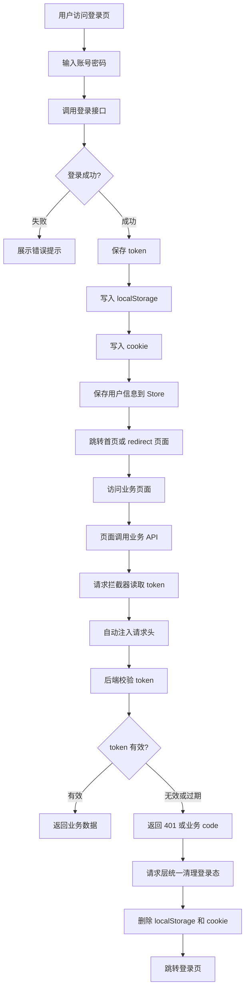

# 从请求层到路由保护：Next.js 项目用户鉴权完整实践

在一个真实的 Next.js 项目里，用户登录并不只是“写一个登录表单，然后把 token 存起来”这么简单。

一个相对完整的用户鉴权系统，至少要解决下面几个问题：

- 用户如何登录？
- 登录成功后 token 存在哪里？
- 页面刷新后如何恢复登录状态？
- 请求接口时如何自动带上 token？
- token 过期后如何统一退出登录？
- 未登录用户访问私有页面时如何跳转？
- 已登录用户访问登录页时如何处理？
- 不同用户、不同角色、不同权限后续如何扩展？

如果这些逻辑分散在各个页面里，项目很快就会变得难以维护。比较好的做法是：把鉴权拆成几个清晰的层次，让每一层只负责一件事。

本文以一个 Next.js + React + TypeScript 项目为背景，结合真实项目中的请求封装、状态管理和路由保护实践，讲清楚一套前端鉴权系统应该如何落地。

---

## 一、先理解：前端鉴权到底在做什么

用户鉴权可以简单理解为两件事：

第一，确认当前用户是谁。

第二，确认当前用户能不能访问某个页面、调用某个接口、执行某个操作。

比如：

- 没登录不能访问资产页。
- 登录后请求资产接口要带 token。
- token 过期后要跳回登录页。
- 普通用户不能看到管理员入口。
- 没有提币权限的用户不能点击提币按钮。

其中最核心的是 token。

用户登录成功后，后端会返回一个 token。前端保存这个 token，之后每次请求需要登录的接口时，把 token 放到请求头里。后端收到请求后，根据 token 判断用户身份。

一个典型请求大概是这样：

```ts
headers: {
  "access-auth-token": token
}
```

这就是前端鉴权最基础的逻辑。

但是在真实项目里，仅仅“保存 token”是不够的。因为 token 可能过期，页面可能刷新，用户可能直接访问私有路由，接口也可能返回业务错误。所以我们需要一整套配套机制。

---

## 二、一套完整的鉴权系统应该包括什么

在 Next.js 项目中，一套比较完整的前端鉴权系统可以拆成六个部分：

```text
1. 登录接口层：负责调用 login/logout 等接口
2. 登录页面层：负责收集账号密码并提交登录
3. 用户状态层：负责保存 token、用户信息、登录状态
4. 请求封装层：负责自动注入 token，统一处理接口错误
5. 路由保护层：负责未登录拦截、登录页重定向
6. 权限扩展层：负责角色、菜单、按钮权限控制
```

它们之间不是互相替代的关系，而是各司其职。

举个例子：

- 登录页面负责“用户怎么登录”。
- Store 负责“当前用户是不是登录状态”。
- 请求层负责“每次请求怎么带 token”。
- 路由层负责“用户能不能进入这个页面”。
- 权限层负责“用户能不能看到某个按钮”。

如果你把所有逻辑都写在登录页里，后期一定会越来越乱。

---

## 三、推荐的目录结构

如果从 0 开始写一个 Next.js 鉴权系统，我建议采用下面这种结构：

```text
src/
├── lib/
│   ├── http.ts              # 创建全局 fetcher/request 实例
│   ├── fetcher.ts           # Axios 封装、拦截器、错误处理
│   └── auth.ts              # token/cookie/localStorage 工具函数，可选
│
├── lib/api/
│   └── login.ts             # 登录、注册、退出登录等接口
│
├── store/
│   └── userStore.ts         # 用户登录态、token、userInfo
│
├── hooks/
│   └── useAuth.ts           # 统一暴露登录态、权限判断、退出登录
│
├── types/
│   └── auth.ts              # 登录参数、用户信息、权限类型
│
├── app/
│   └── (auth)/
│       └── login/
│           └── page.tsx     # 登录页面
│
└── proxy.ts 或 middleware.ts # 路由保护
```

这里的关键是分层。

不要让页面直接操作所有细节。页面只应该关心：

```ts
await login(...)
setToken(...)
router.push(...)
```

至于 token 怎么写入 cookie、请求头怎么注入、登录过期怎么跳转，应该交给更底层的模块统一处理。

---

## 四、整体鉴权流程图

先看完整链路：



这张图里最重要的是：**登录、请求、路由保护、过期退出，是一条完整链路，而不是几个孤立功能。**

---

## 五、第一步：定义登录相关类型

TypeScript 项目里，建议先把登录参数、登录结果、用户信息类型定义清楚。

```ts
/**
 * 文件位置：src/types/auth.ts
 * 文件作用：定义鉴权系统中使用的核心类型
 * 核心能力：
 * 1. 定义登录请求参数
 * 2. 定义登录接口返回值
 * 3. 定义用户信息、角色、权限字段
 */
export interface LoginParams {
  username: string;
  password: string;
  equipment?: string;
}

export interface AuthUser {
  id: number;
  username: string;
  avatar?: string;
  email?: string;
  mobilePhone?: string;
  roles?: string[];
  permissions?: string[];
}

export interface LoginResult {
  token: string;
  salt?: string;
  member?: AuthUser;
}
```

这里预留了 `roles` 和 `permissions`，是为了后面做权限系统。

即使当前项目暂时没有 RBAC，也建议类型设计时留好扩展空间。否则后期加权限时，会到处改类型。

---

## 六、第二步：封装登录接口

登录接口不应该直接写在页面里，应该放到 API service 文件中。

```ts
/**
 * 文件位置：src/lib/api/login.ts
 * 文件作用：封装登录、退出登录等认证相关接口
 * 核心能力：
 * 1. login 调用后端登录接口
 * 2. logout 调用后端退出接口
 * 3. 对外暴露类型明确的 API 方法
 */
import { fetcher } from "@/lib/http";
import type { LoginParams, LoginResult } from "@/types/auth";

export function login(data: LoginParams) {
  return fetcher.post<LoginResult>("/uc/login", {
    ...data,
    equipment: data.equipment ?? "PC",
  });
}

export function logoutApi() {
  return fetcher.post<void>("/uc/loginout");
}
```

这样页面里只需要调用：

```ts
const result = await login({ username, password });
```

不需要关心底层是 Axios、fetch，还是其他请求库。

这也是项目可维护性的关键：**页面调用业务方法，而不是直接拼接口。**

---

## 七、第三步：创建统一请求实例

接下来创建一个全局请求实例。

```ts
/**
 * 文件位置：src/lib/http.ts
 * 文件作用：创建项目统一的请求实例
 * 核心能力：
 * 1. 设置 API 基础地址
 * 2. 对外导出 fetcher
 * 3. 让所有业务接口使用同一个请求层
 */
import { createFetcher } from "@/lib/fetcher";

const isBrowser = typeof window !== "undefined";

export const fetcher = createFetcher({
  baseURL:
    process.env.NEXT_PUBLIC_API_BASE_URL ??
    (isBrowser ? "/api-proxy" : "http://localhost:3000"),
});
```

为什么要单独有一个 `http.ts`？

因为真实项目通常不止一个 API 文件。登录、资产、订单、行情、用户中心都要请求接口。如果每个文件都自己 `axios.create()`，后面改 baseURL、改请求头、改错误处理就会非常麻烦。

统一导出 `fetcher` 后，所有接口都走同一套规则。

---

## 八、第四步：封装 fetcher 请求层

这是整个鉴权系统最关键的一层。

请求层负责：

- 创建 Axios 实例。
- 请求前自动注入 token。
- 请求前自动注入语言、设备类型、签名参数。
- 响应后统一解密。
- 响应后统一拆包。
- 统一处理业务错误。
- 统一处理登录过期。

先看核心结构：

```ts
/**
 * 文件位置：src/lib/fetcher.ts
 * 文件作用：统一封装 Axios 请求层
 * 核心能力：
 * 1. 创建 Axios 实例
 * 2. 请求前自动注入 token、语言、签名
 * 3. 响应后统一处理解密、业务 code、登录过期
 * 4. 对业务层只返回真正的 data
 */
import axios, {
  type AxiosInstance,
  type AxiosRequestConfig,
  type AxiosResponse,
  type InternalAxiosRequestConfig,
} from "axios";
import { toast } from "sonner";

export interface ApiResponse<T = unknown> {
  code: number | string;
  message: string;
  data: T;
}

export class ApiError extends Error {
  code: number | string;
  data?: unknown;

  constructor(message: string, code: number | string, data?: unknown) {
    super(message);
    this.name = "ApiError";
    this.code = code;
    this.data = data;
  }
}

export interface FetcherConfig {
  baseURL: string;
  timeout?: number;
}

export interface Fetcher {
  instance: AxiosInstance;
  get<T>(
    url: string,
    params?: unknown,
    config?: AxiosRequestConfig,
  ): Promise<T>;
  post<T>(url: string, data?: unknown, config?: AxiosRequestConfig): Promise<T>;
  put<T>(url: string, data?: unknown, config?: AxiosRequestConfig): Promise<T>;
  del<T>(
    url: string,
    params?: unknown,
    config?: AxiosRequestConfig,
  ): Promise<T>;
}
```

这里有两个重要类型。

第一个是 `ApiResponse`，表示后端统一返回格式：

```ts
{
  code: 0,
  message: "success",
  data: {}
}
```

第二个是 `ApiError`，表示业务错误。

HTTP 状态码是 200，不代表业务一定成功。比如余额不足、验证码错误、登录过期，都可能是 HTTP 200，但业务 `code` 不等于 0。

所以我们需要 `ApiError` 把这种业务错误抛出去。

---

## 九、请求拦截器：每次请求自动带 token

请求拦截器会在请求真正发出去之前执行。

```ts
const NO_AUTH_URLS = ["/uc/login", "/public/config"];

function createFetcher(fetcherConfig: FetcherConfig): Fetcher {
  const instance = axios.create({
    baseURL: fetcherConfig.baseURL,
    timeout: fetcherConfig.timeout ?? 30_000,
    headers: {
      "Content-Type": "application/x-www-form-urlencoded;charset=utf-8",
      equipment: "PC",
    },
  });

  instance.interceptors.request.use((config: InternalAxiosRequestConfig) => {
    const token =
      typeof window !== "undefined" ? localStorage.getItem("TOKEN") : null;

    const lang =
      typeof window !== "undefined"
        ? (localStorage.getItem("LANGUAGE") ?? "en_us")
        : "en_us";

    config.headers.set("lang", lang);

    if (token) {
      config.headers.set("access-auth-token", token);
    }

    const url = config.url ?? "";
    const needsAuth = !NO_AUTH_URLS.some((u) => url.includes(u));

    if (needsAuth) {
      config.headers.set("timestamp", Date.now().toString());
      config.headers.set("nonce", Math.random().toString(36).slice(2, 10));
    }

    return config;
  });

  // response interceptor...
}
```

这段代码解决了一个非常重要的问题：**业务代码不需要每次手动带 token。**

也就是说，页面不用写：

```ts
fetcher.get(
  "/assets",
  {},
  {
    headers: {
      "access-auth-token": token,
    },
  },
);
```

它只需要写：

```ts
await fetcher.get("/assets");
```

请求层会自动处理 token。

`NO_AUTH_URLS` 是一个白名单，表示这些接口不需要 token 或签名。比如登录接口 `/uc/login`，用户还没登录，不可能有 token，所以必须排除。

---

## 十、响应拦截器：统一处理登录过期

请求成功返回后，响应拦截器会先检查登录状态。

```ts
const NO_REDIRECT_ON_4000_URLS = ["/public/product-list", "/market/list"];

function redirectToLogin() {
  if (typeof window === "undefined") return;

  localStorage.removeItem("TOKEN");
  localStorage.removeItem("salt");
  localStorage.removeItem("user-storage");

  document.cookie = "auth-token=; path=/; max-age=0; SameSite=Lax";

  if (!window.location.pathname.startsWith("/login")) {
    window.location.href = "/login";
  }
}

instance.interceptors.response.use(
  (response: AxiosResponse) => {
    const body = response.data as ApiResponse | null;
    const url = response.config?.url || "";

    if (body?.code === 4000 || body?.code === "4000") {
      const skipRedirect = NO_REDIRECT_ON_4000_URLS.some((u) =>
        url.includes(u),
      );

      if (!skipRedirect) {
        redirectToLogin();
      }

      return Promise.reject(new ApiError("登录已过期", 4000));
    }

    return response;
  },
  (error) => {
    const status = error?.response?.status;

    if (status === 401) {
      redirectToLogin();
    }

    if (typeof window !== "undefined" && error?.message) {
      toast.error(error.message);
    }

    return Promise.reject(error);
  },
);
```

这里处理了两种登录过期：

```text
1. HTTP 401
2. 业务 code = 4000
```

为什么要同时处理？

因为不同后端项目约定不同。有些后端用 HTTP 401 表示未登录，有些后端统一返回 HTTP 200，但在响应体里用 `code=4000` 表示登录过期。

前端应该兼容这两类情况。

---

## 十一、为什么不能把 500 当成登录失效

这是一个很容易踩坑的点。

有些项目会看到接口报错，就直接清 token、跳登录。这样做非常危险。

因为 HTTP 500 通常表示后端异常，比如：

- SQL 报错。
- 服务挂了。
- 空指针异常。
- 参数处理异常。
- 第三方服务失败。

这些都不代表用户登录过期。

如果前端把 500 当成登录失效，用户就会被莫名其妙踢回登录页。正确做法是：

```text
401：未认证，可以跳登录
403：无权限，可以提示无权限
业务 code=4000：登录过期，可以跳登录
500：后端异常，只提示错误，不要清登录态
```

这条原则非常重要：

**登录失效必须有明确标识，不能用所有错误兜底判断。**

---

## 十二、unwrap：让业务层直接拿 data

后端通常返回：

```json
{
  "code": 0,
  "message": "success",
  "data": {
    "id": 1,
    "username": "tom"
  }
}
```

但业务页面真正需要的是：

```ts
{
  id: 1,
  username: "tom"
}
```

所以可以封装一个 `unwrap`：

```ts
function unwrap<T>(res: AxiosResponse<ApiResponse<T>>): T {
  const body = res.data;

  if (body === null || body === undefined || typeof body !== "object") {
    return body as unknown as T;
  }

  if (!("code" in body)) {
    return body as unknown as T;
  }

  if (body.code !== 0 && body.code !== "0") {
    throw new ApiError(body.message || "请求失败", body.code, body.data);
  }

  return body.data;
}
```

然后对外暴露方法：

```ts
return {
  instance,

  get<T>(url: string, params?: unknown, config?: AxiosRequestConfig) {
    return instance
      .get<ApiResponse<T>>(url, { params, ...config })
      .then(unwrap<T>);
  },

  post<T>(url: string, data?: unknown, config?: AxiosRequestConfig) {
    return instance.post<ApiResponse<T>>(url, data, config).then(unwrap<T>);
  },

  put<T>(url: string, data?: unknown, config?: AxiosRequestConfig) {
    return instance.put<ApiResponse<T>>(url, data, config).then(unwrap<T>);
  },

  del<T>(url: string, params?: unknown, config?: AxiosRequestConfig) {
    return instance
      .delete<ApiResponse<T>>(url, { params, ...config })
      .then(unwrap<T>);
  },
};
```

这样页面里可以直接写：

```ts
const user = await fetcher.get<AuthUser>("/uc/member/info");
```

而不是：

```ts
const res = await axios.get("/uc/member/info");
const user = res.data.data;
```

这会让业务代码干净很多。

---

## 十三、第五步：用 Store 管理登录态

登录成功后，需要保存 token、用户信息和登录状态。这里推荐使用 Zustand，也可以换成 Redux、Jotai 或 Context。

```ts
/**
 * 文件位置：src/store/userStore.ts
 * 文件作用：管理用户登录态
 * 核心能力：
 * 1. 保存 token、userInfo、isLogin
 * 2. 登录成功后同步写入 localStorage 和 cookie
 * 3. 退出登录时统一清理登录态
 * 4. 页面刷新后恢复登录状态
 */
import { create } from "zustand";
import { persist } from "zustand/middleware";
import type { AuthUser } from "@/types/auth";

interface UserState {
  token: string | null;
  userInfo: AuthUser | null;
  isLogin: boolean;
  setToken: (token: string) => void;
  setUserInfo: (user: AuthUser) => void;
  logout: () => void;
}

function writeAuthTokenCookie(token: string) {
  document.cookie = `auth-token=${token}; path=/; max-age=86400; SameSite=Lax`;
}

function clearAuthTokenCookie() {
  document.cookie = "auth-token=; path=/; max-age=0; SameSite=Lax";
}

export const useUserStore = create<UserState>()(
  persist(
    (set) => ({
      token: null,
      userInfo: null,
      isLogin: false,

      setToken: (token) => {
        localStorage.setItem("TOKEN", token);
        writeAuthTokenCookie(token);
        set({ token, isLogin: true });
      },

      setUserInfo: (userInfo) => {
        set({ userInfo });
      },

      logout: () => {
        localStorage.removeItem("TOKEN");
        localStorage.removeItem("salt");
        localStorage.removeItem("user-storage");
        clearAuthTokenCookie();

        set({
          token: null,
          userInfo: null,
          isLogin: false,
        });
      },
    }),
    {
      name: "user-storage",
      partialize: (state) => ({
        token: state.token,
        userInfo: state.userInfo,
        isLogin: state.isLogin,
      }),
    },
  ),
);
```

这里有一个关键点：`setToken` 同时写了两份数据。

```ts
localStorage.setItem("TOKEN", token);
writeAuthTokenCookie(token);
```

为什么既要 localStorage，又要 cookie？

---

## 十四、localStorage 和 cookie 分别负责什么

这也是很多新手最容易混乱的地方。

### 1. localStorage 给客户端 JS 用

请求拦截器运行在浏览器里，它可以读取 localStorage：

```ts
const token = localStorage.getItem("TOKEN");
```

所以 localStorage 主要负责：

```text
让 Axios 请求层拿到 token，并把 token 放到请求头里。
```

### 2. cookie 给 Next.js 路由保护用

Next.js 的 `proxy.ts` 或 `middleware.ts` 运行在请求阶段，它不能直接读取浏览器 localStorage。

但它可以读取 cookie：

```ts
const token = request.cookies.get("auth-token")?.value;
```

所以 cookie 主要负责：

```text
让路由保护在页面渲染前就知道用户是否登录。
```

### 3. 为什么退出登录时两者都要清理

如果只清 localStorage，不清 cookie，就会出现：

```text
请求层认为未登录
但路由层认为已登录
```

用户访问 `/login` 时，路由层可能因为 cookie 还在，把用户重定向到首页，导致用户无法重新登录。

如果只清 cookie，不清 localStorage，就会出现：

```text
路由层认为未登录
但请求层仍然带旧 token
```

这也会造成状态混乱。

所以登录态清理必须成套进行：

```ts
localStorage.removeItem("TOKEN");
localStorage.removeItem("salt");
document.cookie = "auth-token=; path=/; max-age=0; SameSite=Lax";
```

一句话总结：

**localStorage 给客户端请求用，cookie 给服务端/路由保护用，两者必须保持一致。**

---

## 十五、第六步：实现登录页面

登录页面主要负责四件事：

```text
1. 收集账号密码
2. 调用登录接口
3. 登录成功后保存 token 和用户信息
4. 跳转到首页或原目标页面
```

示例代码：

```tsx
/**
 * 文件位置：src/app/(auth)/login/page.tsx
 * 文件作用：登录页面
 * 核心流程：
 * 1. 用户输入账号密码
 * 2. 调用 login 接口
 * 3. 保存 token、salt、userInfo
 * 4. 跳转 redirect 或首页
 */
"use client";

import { useRouter } from "next/navigation";
import { useState } from "react";
import { toast } from "sonner";
import { login } from "@/lib/api/login";
import { useUserStore } from "@/store/userStore";

export default function LoginPage() {
  const router = useRouter();

  const setToken = useUserStore((state) => state.setToken);
  const setUserInfo = useUserStore((state) => state.setUserInfo);

  const [username, setUsername] = useState("");
  const [password, setPassword] = useState("");

  async function handleLogin() {
    try {
      const result = await login({
        username,
        password,
        equipment: "PC",
      });

      setToken(result.token);

      if (result.salt) {
        localStorage.setItem("salt", result.salt);
      }

      if (result.member) {
        setUserInfo(result.member);
      }

      toast.success("登录成功");

      const redirect = new URLSearchParams(window.location.search).get(
        "redirect",
      );

      router.push(redirect || "/");
    } catch (error) {
      const message = error instanceof Error ? error.message : "登录失败";
      toast.error(message);
    }
  }

  return (
    <main>
      <h1>登录</h1>

      <input
        value={username}
        onChange={(event) => setUsername(event.target.value)}
        placeholder="请输入账号"
      />

      <input
        value={password}
        onChange={(event) => setPassword(event.target.value)}
        placeholder="请输入密码"
        type="password"
      />

      <button onClick={handleLogin}>登录</button>
    </main>
  );
}
```

真实项目中可以进一步加上：

- `react-hook-form`
- `zod`
- loading 状态
- 国际化文案
- 邮箱/手机号切换
- 验证码登录
- 第三方登录

但核心逻辑就是上面这几步。

---

## 十六、第七步：路由保护

请求层鉴权解决的是“接口请求时有没有身份”。

路由保护解决的是“进入页面前是否允许访问”。

在 Next.js 中，可以使用 `proxy.ts` 或 `middleware.ts` 实现。

```ts
/**
 * 文件位置：src/proxy.ts
 * 文件作用：路由保护
 * 核心能力：
 * 1. 未登录访问私有页面时跳转登录页
 * 2. 已登录访问登录页时跳转首页
 * 3. 保留 redirect 参数，登录后回到原页面
 */
import { NextResponse } from "next/server";
import type { NextRequest } from "next/server";

const protectedRoutes = ["/assets", "/user", "/orders", "/records"];
const authRoutes = ["/login", "/register"];

export function proxy(request: NextRequest) {
  const { pathname } = request.nextUrl;
  const token = request.cookies.get("auth-token")?.value;

  const isProtectedRoute = protectedRoutes.some((route) =>
    pathname.startsWith(route),
  );

  if (isProtectedRoute && !token) {
    const loginUrl = new URL("/login", request.url);
    loginUrl.searchParams.set("redirect", pathname);
    return NextResponse.redirect(loginUrl);
  }

  const isAuthRoute = authRoutes.some((route) => pathname.startsWith(route));

  if (isAuthRoute && token) {
    return NextResponse.redirect(new URL("/", request.url));
  }

  return NextResponse.next();
}
```

这里有两个判断。

### 1. 未登录访问私有页面

比如用户没登录，直接访问：

```text
/assets
```

路由保护发现没有 `auth-token` cookie，就跳转到：

```text
/login?redirect=/assets
```

登录成功后再跳回原页面。

### 2. 已登录访问登录页

比如用户已经登录，又访问：

```text
/login
```

这时应该直接跳首页，避免重复登录。

---

## 十七、为什么请求层鉴权和路由层鉴权都要做

很多新手会问：既然请求层已经能处理 401，为什么还要做路由保护？

因为两者处理的时机不同。

### 路由层鉴权：进入页面前

比如用户未登录访问资产页：

```text
/assets
```

路由保护可以在页面渲染前直接拦截，跳到登录页。

用户不会先看到资产页空壳，也不会等接口报错后才跳转。

### 请求层鉴权：页面运行中

比如用户已经打开交易页很久，token 在页面停留期间过期了。

这时路由保护不会重新执行，因为用户没有重新进入页面。但用户点击“下单”时，接口会返回 401 或 code=4000。

这时必须由请求层处理：

```ts
if (status === 401 || body.code === 4000) {
  redirectToLogin();
}
```

所以结论是：

```text
路由保护负责“能不能进页面”
请求层负责“请求时身份是否还有效”
```

两者不能互相替代。

---

## 十八、第八步：封装 useAuth

当项目越来越大时，页面里不应该到处直接使用 `useUserStore`。更推荐封装一个 `useAuth`，统一暴露鉴权能力。

```ts
/**
 * 文件位置：src/hooks/useAuth.ts
 * 文件作用：统一暴露登录态和权限判断
 * 核心能力：
 * 1. 获取当前用户信息
 * 2. 判断是否登录
 * 3. 执行退出登录
 * 4. 判断用户是否拥有某个权限
 */
import { useUserStore } from "@/store/userStore";

export function useAuth() {
  const token = useUserStore((state) => state.token);
  const userInfo = useUserStore((state) => state.userInfo);
  const isLogin = useUserStore((state) => state.isLogin);
  const logout = useUserStore((state) => state.logout);

  const hasPermission = (permission: string) => {
    return userInfo?.permissions?.includes(permission) ?? false;
  };

  const hasRole = (role: string) => {
    return userInfo?.roles?.includes(role) ?? false;
  };

  return {
    token,
    userInfo,
    isLogin,
    logout,
    hasPermission,
    hasRole,
  };
}
```

页面中使用：

```tsx
"use client";

import { useAuth } from "@/hooks/useAuth";

export default function AssetsPage() {
  const { isLogin, userInfo } = useAuth();

  if (!isLogin) {
    return <div>请先登录</div>;
  }

  return <div>欢迎你，{userInfo?.username}</div>;
}
```

按钮权限判断：

```tsx
const { hasPermission } = useAuth();

{
  hasPermission("withdraw:create") && <button>提币</button>;
}
```

这样后续权限系统扩展时，不需要改大量页面代码。

---

## 十九、如何扩展不同用户权限

很多项目一开始只有登录状态，没有完整权限系统。但如果项目后面要支持管理员、普通用户、运营用户、审核员，就需要做 RBAC 或权限点控制。

推荐后端登录接口返回：

```json
{
  "token": "xxx",
  "member": {
    "id": 1,
    "username": "tom",
    "roles": ["user", "admin"],
    "permissions": ["asset:view", "withdraw:create"]
  }
}
```

前端保存到 store：

```ts
setUserInfo(result.member);
```

菜单配置可以这样写：

```ts
/**
 * 文件位置：src/config/menu.ts
 * 文件作用：配置侧边栏或导航菜单
 * 核心能力：
 * 1. 定义菜单路径
 * 2. 定义菜单所需权限
 * 3. 根据用户 permissions 过滤菜单
 */
export const menus = [
  {
    label: "资产",
    href: "/assets",
    permission: "asset:view",
  },
  {
    label: "订单",
    href: "/orders",
    permission: "order:view",
  },
  {
    label: "用户管理",
    href: "/admin/users",
    permission: "user:manage",
  },
];
```

过滤菜单：

```ts
import { menus } from "@/config/menu";
import { useAuth } from "@/hooks/useAuth";

export function useVisibleMenus() {
  const { hasPermission } = useAuth();

  return menus.filter((menu) => {
    if (!menu.permission) return true;
    return hasPermission(menu.permission);
  });
}
```

权限可以分成三层：

```text
1. 页面权限：能不能访问某个页面
2. 菜单权限：能不能看到某个入口
3. 按钮权限：能不能执行某个动作
```

更安全的做法是：

- 前端负责隐藏入口和优化体验。
- 后端负责最终权限校验。
- 前端不能替代后端权限控制。

---

## 二十、退出登录应该怎么写

退出登录不只是调用一个接口，还要清理本地状态。

```ts
/**
 * 文件位置：src/lib/api/logout.ts 或 src/lib/api/login.ts
 * 文件作用：退出登录
 * 核心流程：
 * 1. 调用后端退出接口
 * 2. 清理 token
 * 3. 清理 cookie
 * 4. 清理用户信息
 * 5. 跳转登录页
 */
import { logoutApi } from "@/lib/api/login";
import { useUserStore } from "@/store/userStore";

export function useLogout() {
  const logout = useUserStore((state) => state.logout);

  async function handleLogout() {
    try {
      await logoutApi();
    } finally {
      logout();
      window.location.href = "/login";
    }
  }

  return handleLogout;
}
```

这里用 `finally` 是为了保证：即使后端退出接口失败，前端本地登录态也要清掉。

因为用户点击退出登录，前端体验上就应该立即退出。

---

## 二十一、真实项目里容易忽略的几个细节

### 1. 不要直接 `localStorage.clear()`

有些代码登录过期时会写：

```ts
localStorage.clear();
```

这虽然简单，但可能会误删语言、主题、用户偏好、缓存数据。

更稳妥的是只清认证相关 key：

```ts
localStorage.removeItem("TOKEN");
localStorage.removeItem("salt");
localStorage.removeItem("user-storage");
```

### 2. 退出登录时要清 cookie

否则路由保护仍然会认为用户已登录。

```ts
document.cookie = "auth-token=; path=/; max-age=0; SameSite=Lax";
```

### 3. 登录成功后要保留 redirect

用户访问 `/assets` 被拦截到登录页，登录成功后应该回到 `/assets`，而不是统一回首页。

```ts
const redirect = new URLSearchParams(window.location.search).get("redirect");
router.push(redirect || "/");
```

### 4. 500 不应该跳登录

再次强调，500 是服务端异常，不是登录失效。

### 5. 请求层要有静默接口配置

行情、轮询、弱依赖接口不适合频繁 toast。

```ts
const SILENT_URLS = ["/market/", "/symbol-thumb"];
```

---

## 二十二、推荐的最终代码职责划分

整理一下，一套比较清晰的职责应该是这样：

```text
src/types/auth.ts
定义登录参数、用户信息、权限类型。

src/lib/api/login.ts
封装 login、logout、register 等认证接口。

src/lib/http.ts
创建全局 fetcher 实例，统一配置 baseURL。

src/lib/fetcher.ts
封装 Axios，请求前注入 token，响应后处理错误和登录过期。

src/store/userStore.ts
保存 token、userInfo、isLogin，并同步 localStorage/cookie。

src/hooks/useAuth.ts
对页面暴露 isLogin、userInfo、logout、hasPermission。

src/app/(auth)/login/page.tsx
登录页面，负责表单、调用 login、保存登录态、跳转。

src/proxy.ts 或 src/middleware.ts
路由保护，未登录访问私有页面时跳转登录页。
```

这套结构的好处是：每个文件的职责非常清楚。

以后你要改登录接口，就去 `login.ts`。

要改 token 注入，就去 `fetcher.ts`。

要改登录态保存，就去 `userStore.ts`。

要改路由保护，就去 `proxy.ts`。

要改页面 UI，就去 `login/page.tsx`。

---

## 二十三、总结

Next.js 项目里的用户鉴权，不能只写一个登录页，也不能只把 token 存到 localStorage 就结束。

一套更完整、更可维护的鉴权系统，应该形成这样一条链路：

```text
登录页提交账号密码
        ↓
调用登录接口
        ↓
后端返回 token 和用户信息
        ↓
Store 保存登录态
        ↓
localStorage 保存 token，供请求层读取
        ↓
cookie 保存 token，供路由保护读取
        ↓
请求拦截器自动注入 token
        ↓
响应拦截器统一处理 401 / code=4000
        ↓
登录过期时清理登录态并跳转登录页
        ↓
页面和按钮根据权限控制展示
```

这套设计的核心思想是分层：

- 页面层负责用户交互。
- API 层负责接口调用。
- Store 层负责登录状态。
- 请求层负责 token 注入和登录过期兜底。
- 路由层负责页面访问控制。
- 权限层负责角色、菜单、按钮控制。

如果你以后要在 Next.js 项目中写用户鉴权，可以直接照着这套思路搭建。不要把所有逻辑塞进登录页，也不要让每个接口手动带 token。

好的鉴权系统不是写得多复杂，而是每一层职责清楚、边界清楚、出了问题知道去哪里改。

最后记住一句话：

**路由层解决“能不能进页面”，请求层解决“请求时身份是否有效”，Store 解决“当前用户是谁”，cookie 让服务端侧能判断登录，localStorage 让客户端请求能拿到 token。**
