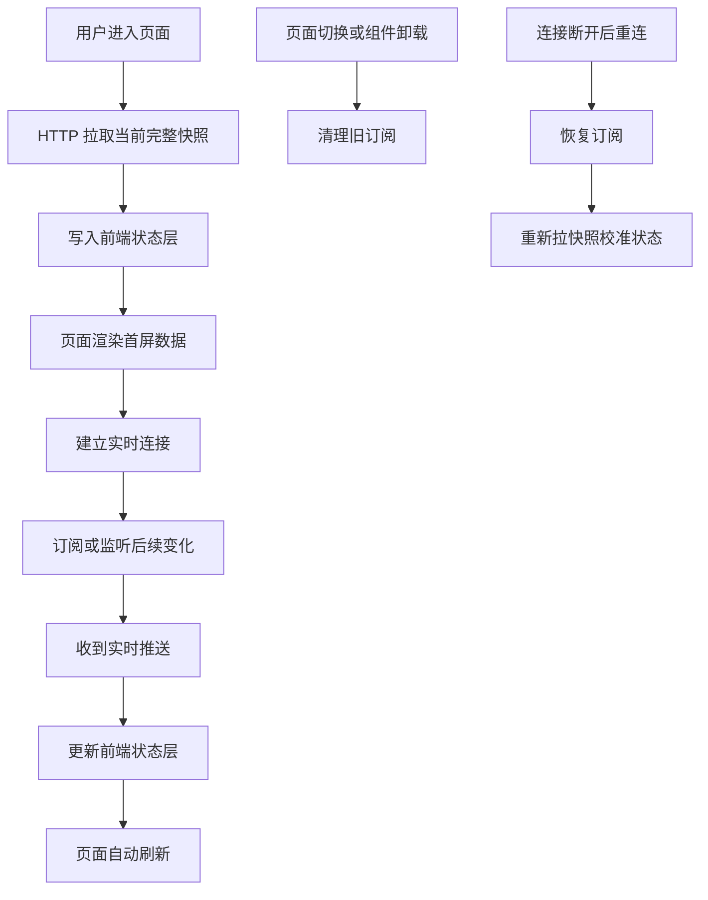

# HTTP 快照 + MQTT 实时推送：一种更稳的前端实时数据架构

做实时页面时，很多人第一反应是：既然要实时，那直接上 WebSocket 或 MQTT 不就好了？

其实不一定。

真正复杂的实时页面，往往不是“能不能收到推送”这么简单，而是要同时解决两个问题：

```text
页面刚打开时，我要拿到当前完整状态；
页面打开之后，我要持续接收后续变化。
```

第一个问题适合用 HTTP。
第二个问题适合用 WebSocket、MQTT 或 SSE。

所以在很多实时业务里，更稳妥的方案不是单独依赖某一种通信方式，而是：

```text
HTTP 快照 + 实时推送
```

也可以叫：

```text
Snapshot + Stream
Snapshot First, Realtime Later
快照初始化 + 增量更新
初始状态拉取 + 后续实时同步
```

它的核心思想很简单：

> HTTP 负责告诉你“现在是什么样”，实时推送负责告诉你“之后发生了什么变化”。

---

## 一、为什么不能只靠 HTTP？

HTTP 是请求-响应模型。

你发一次请求，服务端返回一次数据：

```text
前端：给我当前数据
后端：这是当前数据
```

它很适合拿完整状态。

比如：

```text
当前订单列表
当前设备状态
当前聊天室历史消息
当前在线人数
当前行情盘口
当前任务进度
```

这些数据都适合通过 HTTP 一次性拉回来。

但 HTTP 的问题是：它不是持续连接。

如果数据一直在变化，你只能轮询：

```text
每 1 秒请求一次
每 3 秒请求一次
每 5 秒请求一次
```

轮询太慢，页面不够实时；轮询太快，请求量又会变大。

所以 HTTP 很适合做：

```text
初始化
完整快照
状态校准
兜底同步
```

但不适合承担所有高频实时更新。

---

## 二、为什么不能只靠实时推送？

既然 HTTP 不够实时，那是不是只用 WebSocket、MQTT 或 SSE 就行？

也不一定。

实时推送擅长告诉你：

```text
刚刚新增了一条消息
某个订单状态变了
某个设备温度更新了
某个价格发生了变化
某个任务进度从 30% 到 40%
```

但它不一定天然负责“完整初始化”。

举个例子，你进入一个实时订单页面，如果只等推送：

```text
订单 A 状态变更
订单 C 新增
订单 B 被取消
```

你能收到后续变化，但你一开始并不知道当前到底有多少订单。

又比如聊天室，如果只接收新消息，你能看到别人之后发的消息，但你看不到进入房间之前的历史消息。

再比如实时看板，如果只等推送，你可能会看到某个指标更新了，但不知道所有指标的初始值是多少。

所以实时推送很适合做：

```text
后续变化
增量更新
低延迟同步
多端状态通知
```

但它不适合单独承担页面初始化。

---

## 三、HTTP 快照 + 实时推送到底怎么配合？

这套模式的运行流程可以概括为：

```text
用户进入页面
        ↓
HTTP 请求当前完整数据
        ↓
页面先渲染初始状态
        ↓
建立实时连接
        ↓
订阅或监听后续变化
        ↓
收到推送后更新本地状态
        ↓
页面持续刷新
```

可以画成这样：



这里最关键的是：**HTTP 和实时推送不是互相替代，而是分工合作。**

HTTP 负责“起点”，推送负责“过程”。

---

## 四、什么是“快照”？

快照就是某一个时间点的完整状态。

它像拍照。

比如你进入一个页面，服务端告诉你：

```json
{
  "onlineUsers": 128,
  "messages": [
    { "id": 1, "text": "hello" },
    { "id": 2, "text": "hi" }
  ],
  "roomStatus": "active"
}
```

这就是当前房间状态的一张快照。

它不是持续变化的数据流，而是某一刻的完整结果。

在不同业务里，快照可以是：

```text
聊天室最近 50 条消息
订单列表当前状态
设备当前运行数据
交易行情当前盘口
任务当前进度
协作文档当前内容
```

快照解决的问题是：

```text
我刚进页面时，当前完整状态是什么？
```

---

## 五、什么是“实时推送”？

实时推送关注的是进入页面之后发生的变化。

比如聊天室里新增一条消息：

```json
{
  "type": "message_created",
  "payload": {
    "id": 3,
    "text": "new message"
  }
}
```

订单状态发生变化：

```json
{
  "type": "order_updated",
  "payload": {
    "orderId": "1001",
    "status": "paid"
  }
}
```

设备状态变化：

```json
{
  "type": "device_temperature_changed",
  "payload": {
    "deviceId": "A001",
    "temperature": 28.6
  }
}
```

这些都不是完整快照，而是后续变化。

实时推送解决的问题是：

```text
我进入页面之后，又发生了什么？
```

---

## 六、这套架构需要哪些组成部分？

一个标准的 Snapshot + Stream 架构，通常包含四层。

### 1. Snapshot API

也就是普通 HTTP 接口。

它负责返回当前完整状态。

例如：

```ts
async function fetchRoomSnapshot(roomId: string) {
  return request.get(`/rooms/${roomId}/snapshot`);
}
```

它适合拿：

```text
完整列表
当前状态
历史数据
初始化数据
```

### 2. Realtime Channel

也就是实时连接。

可以是：

```text
WebSocket
MQTT
SSE
```

它负责接收后续变化。

例如：

```ts
const ws = new WebSocket("wss://example.com/ws");
```

或者：

```ts
mqttClient.subscribe(`room/${roomId}/messages`, handler);
```

### 3. State Store

也就是前端状态层。

可以是：

```text
Zustand
Redux
Jotai
Vuex
Pinia
React Query cache
组件本地 state
```

它负责把 HTTP 快照和实时推送合并成页面能读取的状态。

更推荐把实时共享数据放到统一状态层，而不是散落在各个组件的 `useState` 里。

### 4. Cleanup 机制

实时页面一定要考虑清理。

例如：

```text
用户切换房间
用户切换交易对
用户离开页面
组件卸载
连接断开重连
```

如果旧订阅不清理，就会出现旧数据继续写入页面的问题。

---

## 七、最小实现长什么样？

下面是一个简化版的通用写法。

假设我们做一个实时房间页面：

```ts
useEffect(() => {
  let cancelled = false;

  fetchRoomSnapshot(roomId).then((snapshot) => {
    if (!cancelled) {
      setRoomState(snapshot);
    }
  });

  const off = realtimeClient.subscribe(`room/${roomId}`, (event) => {
    applyRoomEvent(event);
  });

  return () => {
    cancelled = true;
    off();
  };
}, [roomId]);
```

这段代码体现了三个关键动作。

第一，先拉快照：

```ts
fetchRoomSnapshot(roomId).then((snapshot) => {
  if (!cancelled) {
    setRoomState(snapshot);
  }
});
```

第二，再接推送：

```ts
const off = realtimeClient.subscribe(`room/${roomId}`, (event) => {
  applyRoomEvent(event);
});
```

第三，离开时清理：

```ts
return () => {
  cancelled = true;
  off();
};
```

这就是 Snapshot + Stream 的最小模型。

---

## 八、为什么 cleanup 里既要 off，也要 cancelled？

这两个东西解决的是不同问题。

`off()` 解决的是实时订阅问题。

```text
我不想继续收到这个频道的后续推送了
```

比如用户从 A 页面切到 B 页面，就要取消 A 页面相关订阅。

`cancelled = true` 解决的是 HTTP 异步返回问题。

举个例子：

```text
1. 用户进入 A 页面，发出 HTTP 请求
2. 请求还没回来
3. 用户马上切到 B 页面
4. B 页面发出新的 HTTP 请求
5. A 页面请求晚一点返回
```

如果没有 `cancelled`，A 页面的旧响应可能会在用户已经切到 B 页面后继续写入状态，导致页面出现旧数据。

所以：

```text
off 负责清理实时推送
cancelled 负责拦截过期 HTTP 响应
```

二者都需要。

---

## 九、为什么重连后还要重新拉快照？

很多实时连接都有自动重连能力。

比如 MQTT 断开后重新连接，并恢复之前订阅的 topic。

但恢复订阅不代表状态一定准确。

因为断线期间可能发生了很多变化：

```text
订单状态变了
聊天室新增了消息
设备状态更新了
行情价格变化了
任务进度推进了
```

这些变化如果没有被补发，前端状态就会落后。

所以更稳妥的策略是：

```text
重连成功
  ↓
恢复订阅
  ↓
重新拉一遍 HTTP 快照
  ↓
用快照校准本地状态
```

也就是说，重连后只恢复实时流还不够，最好重新用快照纠偏。

这在状态型数据里尤其重要。

比如：

```text
订单列表
账户资产
设备状态
盘口数据
协作文档状态
```

这些数据都不能长期依赖“断线前的旧状态 + 断线后的新推送”。

---

## 十、这种模式适合哪些业务？

这套模式适合一种非常典型的业务：

```text
进入页面时需要完整状态；
页面运行期间持续发生变化。
```

常见场景包括：

```text
交易行情：先拉盘口快照，再接成交和盘口推送
聊天室：先拉历史消息，再接新消息
订单系统：先拉订单列表，再接订单状态变化
物流轨迹：先拉完整轨迹，再接最新节点
实时看板：先拉指标快照，再接指标变化
IoT 设备：先拉设备状态，再接传感器数据
在线协作：先拉文档内容，再接编辑操作
AI 任务：先拉任务状态，再接生成进度
游戏房间：先拉房间状态，再接玩家动作
```

这些场景的共同点是：

```text
只靠 HTTP 不够实时；
只靠推送又缺少稳定初始化；
所以适合 HTTP 快照 + 实时推送。
```

---

## 十一、哪些页面不需要这么复杂？

不是所有页面都需要这套架构。

如果数据变化不频繁，普通 HTTP 就够了。

比如：

```text
用户资料页
后台普通列表页
静态详情页
表单提交页
低频配置页
文章详情页
设置页面
```

这些页面没有必要为了“看起来高级”强行引入 WebSocket 或 MQTT。

技术选型要看业务是否真的需要实时性。

如果用户刷新一下也能接受，那 HTTP + React Query 就已经足够。

---

## 十二、落地时有哪些坑？

### 1. 快照和推送的数据结构要对齐

HTTP 返回的是完整状态，推送可能是完整状态，也可能是增量变化。

如果推送是完整状态，可以直接覆盖。

```ts
setState(payload);
```

如果推送是增量，就必须合并。

```ts
applyDelta(prevState, delta);
```

最怕的是：后端推的是 delta，前端却当成完整状态覆盖。

### 2. 实时消息要考虑去重

有些数据可能同时出现在 HTTP 快照和实时推送里。

比如：

```text
HTTP 返回最近 50 条消息
实时推送又推了其中最后一条
```

如果不去重，页面就会重复展示。

### 3. 订阅要和页面状态绑定

用户切换房间、切换设备、切换交易对时，旧订阅必须清理。

否则会出现：

```text
当前页面是 B
但 A 的消息还在更新页面
```

### 4. 连接重连后要校准

自动重连只能保证连接恢复，不一定保证断线期间的数据完整。

关键数据最好重新拉快照。

### 5. 不要让每个组件都建连接

实时连接应该尽量复用。

更好的方式是：

```text
全局一个 realtime client
多个组件订阅不同 topic/channel
最后一个订阅者离开时再真正取消订阅
```

这能减少连接数，也能降低后端压力。

---

## 十三、在前端项目里可以怎么封装？

可以抽象成一个通用 Hook：

```ts
function useSnapshotStream<TSnapshot, TEvent>({
  snapshotKey,
  fetchSnapshot,
  subscribe,
  applySnapshot,
  applyEvent,
}: {
  snapshotKey: string;
  fetchSnapshot: () => Promise<TSnapshot>;
  subscribe: (handler: (event: TEvent) => void) => () => void;
  applySnapshot: (snapshot: TSnapshot) => void;
  applyEvent: (event: TEvent) => void;
}) {
  useEffect(() => {
    let cancelled = false;

    fetchSnapshot().then((snapshot) => {
      if (!cancelled) {
        applySnapshot(snapshot);
      }
    });

    const off = subscribe((event) => {
      applyEvent(event);
    });

    return () => {
      cancelled = true;
      off();
    };
  }, [snapshotKey]);
}
```

业务使用时，只需要传入：

```text
怎么拉快照
怎么订阅推送
快照怎么写入状态
推送怎么合并状态
什么时候重新执行
```

这样就能把“快照 + 推送”的模式从具体业务里抽出来。

---

## 十四、一个行情页面可以如何落地？

以交易行情页面为例，可以这样设计：

```text
HTTP 快照：
- 当前 24h 行情
- 当前盘口
- 最近成交
- 历史 K 线

MQTT 推送：
- 最新成交
- 盘口变化
- K 线更新
- 最新价变化

状态层：
- thumbMap 保存 24h 行情
- orderBookMap 保存盘口
- tradeMap 保存成交
- K 线由图表实例维护

清理机制：
- 切换交易对时取消旧 topic
- 组件卸载时移除 handler
- HTTP 请求晚返回时不再写入状态
- 重连后重新拉快照校准
```

最核心的代码结构大概是：

```ts
useEffect(() => {
  let cancelled = false;

  getOrderBookSnapshot(symbol).then((snapshot) => {
    if (!cancelled) {
      setOrderBook(symbol, snapshot);
    }
  });

  const off = mqttClient.subscribe(`orderbook/${symbol}`, (payload) => {
    setOrderBook(symbol, payload);
  });

  return () => {
    cancelled = true;
    off();
  };
}, [symbol]);
```

如果后端推的是完整盘口，可以直接 `setOrderBook`。
如果后端推的是盘口增量，就要改成 `applyOrderBookDelta`。

---

## 十五、总结

HTTP 快照 + 实时推送，本质上是在解决两个问题：

```text
HTTP 快照：页面刚进入时，当前完整状态是什么？
实时推送：页面打开之后，又发生了什么变化？
```

它不是某个具体项目里的特殊写法，而是一种很通用的实时数据架构。

它的基本组成是：

```text
Snapshot API：负责初始化完整状态
Realtime Channel：负责接收后续变化
State Store：负责统一承接和合并数据
Cleanup：负责清理旧订阅和过期请求
Reconnect Sync：负责断线后的状态校准
```

这套模式适合所有“进入时要完整状态，运行中又持续变化”的页面。

一句话总结：

**实时页面不是只要长连接就够了。更稳的设计是：先用 HTTP 拿到当前完整快照，再用 MQTT / WebSocket / SSE 接住后续变化，最后通过统一状态层把两类数据合并给页面使用。**
