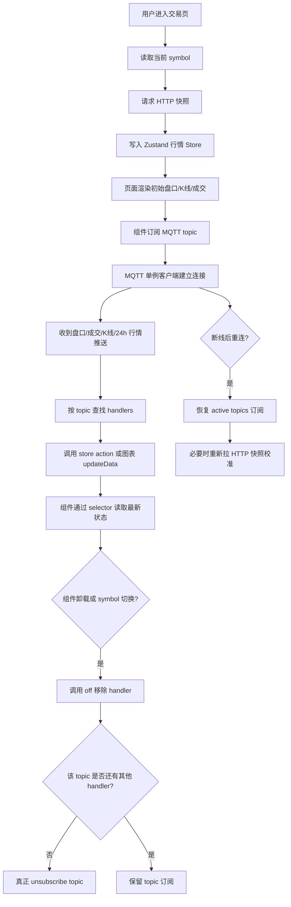

# 从 MQTT 单例客户端到 Zustand 行情 Store：Next.js 交易所实时行情系统实践

交易所前端和普通业务系统最大的不同，是页面上的数据一直在变化。

用户打开 BTC/USDT 交易页时，最新价、涨跌幅、买卖盘口、实时成交、K 线图都在不断更新。对于这类高频数据，如果只靠 HTTP 轮询，每隔几秒请求一次，用户看到的行情会明显滞后，请求量也会很大；但如果完全依赖长连接，又会遇到另一个问题：用户刚进入页面时，前端手里没有完整的盘口、历史成交和历史 K 线，只能等后端一点点推送，首屏体验会很差。

所以交易所前端更常见的做法是：

- **HTTP 快照**：页面首次加载时，一次性获取当前完整状态。
- **MQTT 增量推送**：页面运行过程中，持续接收行情变化。
- **Zustand Store**：承接高频实时状态，让多个组件共享数据。
- **React Query**：管理 HTTP 快照请求的 loading、error 和 refetch。

本文以一个 Next.js + React + TypeScript 的数字资产交易平台前端为例，讲清楚如何设计一套实时行情系统：从 MQTT 单例客户端，到 Zustand 行情 store，再到盘口、成交、K 线和 24h 行情的实时更新。

---

## 一、为什么交易所前端需要实时行情系统

交易页里常见的实时数据主要有四类：

1. **24h 行情**：最新价、涨跌幅、最高价、最低价、成交量。
2. **盘口数据**：买盘 bids、卖盘 asks。
3. **最新成交**：实时成交价格、数量、方向和时间。
4. **K 线数据**：历史 candle，以及当前 candle 的实时更新。

这些数据有几个共同特点：

- 更新频率高。
- 多个组件会同时使用。
- 首屏需要完整状态。
- 后续只需要接收变化。
- 切换交易对时要清理旧订阅。
- 网络断开重连后要恢复订阅，必要时重新校准快照。

因此，交易所前端不能简单地“开一个 WebSocket 收消息”就结束，而是需要一套完整的数据链路：**先拿快照，再接增量；组件订阅，卸载清理；断线重连，恢复订阅；高频数据，控制渲染。**

---

## 二、HTTP、WebSocket、SSE、MQTT 分别适合什么

在讲具体实现之前，先区分几个容易混淆的概念。

### HTTP 轮询

HTTP 轮询就是前端每隔一段时间请求一次接口。它适合用户资料、订单记录、资产列表这类低频数据，但不适合盘口和成交这种高频行情。

如果盘口每秒都在变化，而前端每 3 秒请求一次，用户看到的数据一定会滞后。同时，大量用户同时轮询，也会给后端接口带来额外压力。

### WebSocket

WebSocket 是浏览器和服务端之间的双向通信通道。它适合聊天室、协同编辑、实时通知、交易回报等场景。

不过 WebSocket 本身只是传输通道。具体订阅什么数据、如何区分消息类型、如何取消订阅，都需要业务层自己设计。

### SSE

SSE，全称 Server-Sent Events，是服务端到客户端的单向推送。它适合通知流、日志流、任务进度这类单向数据推送场景。

但对于交易所行情这种多 topic、多交易对、多组件订阅的场景，SSE 的灵活性通常不如 WebSocket 或 MQTT。

### MQTT

MQTT 是一种发布/订阅协议。它天然支持 topic 模型，比如：

```text
exchange-plate/BTC-USDT
exchange-trade-pc/BTC-USDT
exchange-kline/BTC-USDT
```

浏览器前端通常通过 **MQTT over WebSocket** 连接 broker。也就是说，底层连接走的是 WebSocket，但上层协议是 MQTT。

交易所行情非常适合 MQTT 的 topic 模型：用户看哪个交易对，就订阅哪个交易对的盘口、成交、K 线；离开页面或切换交易对时，再取消旧 topic 的订阅。

---

## 三、整体架构：HTTP 快照 + MQTT 增量推送

一套比较清晰的交易所实时行情架构，可以分成四层：

```text
组件层
  ↓
Hooks 层：useMarketSubscribe / useOrderBook / useTrades / useKline
  ↓
状态层：Zustand marketStore
  ↓
数据层：HTTP 快照 API + MQTT 单例客户端
```

整体流程是：

1. 用户进入交易页，页面根据 URL 解析出当前交易对。
2. React Query 或自定义 hook 请求 HTTP 快照。
3. 快照写入 Zustand store，页面先渲染初始盘口、成交、K 线。
4. 组件订阅对应的 MQTT topic。
5. MQTT 收到推送后，根据 topic 分发给 handler。
6. handler 调用 store action，更新盘口、成交、ticker 等数据。
7. 组件通过 selector 读取最新状态并渲染。
8. 组件卸载或 symbol 切换时，清理旧订阅。
9. MQTT 断线重连后，恢复已有 topic 订阅。
10. 对于盘口这类状态型数据，必要时重连后重新拉快照校准。

---

## 四、实时行情数据流流程图



这张图的核心是：**MQTT 连接是全局单例，组件只是订阅 topic；HTTP 负责初始状态，MQTT 负责后续变化，Zustand 负责承接实时数据。**

---

## 五、项目中的实时行情链路概览

在这个交易所前端项目中，实时行情系统主要由几个模块组成：

```ts
/**
 * 文件位置：src/lib/mqtt.ts
 * 文件作用：MQTT 单例客户端，负责连接、订阅、取消订阅、消息分发和重连恢复
 * 核心能力：
 * 1. 使用 mqtt.js over WebSocket
 * 2. 全局只维护一个 MQTT client
 * 3. 维护 topic -> handlers 映射
 * 4. 支持多组件订阅复用
 * 5. 最后一个 handler 移除后才真正 unsubscribe
 * 6. reconnect 后恢复已有 topic 订阅
 */
```

```ts
/**
 * 文件位置：src/store/marketStore.ts
 * 文件作用：Zustand 行情 store，保存实时行情状态
 * 核心能力：
 * 1. thumbMap 保存 24h 行情
 * 2. plateMap 保存盘口数据
 * 3. tradeMap 保存最新成交
 * 4. 成交列表只保留最近 N 条
 * 5. 提供 selector，减少不必要重渲染
 */
```

```ts
/**
 * 文件位置：src/hooks/use-market-subscribe.ts
 * 文件作用：行情订阅 hook，组合 HTTP 快照和 MQTT 增量推送
 * 核心流程：
 * 1. 根据 symbol 和 type 请求行情快照
 * 2. 将快照写入 marketStore
 * 3. 订阅 thumb / plate / trade topic
 * 4. 收到推送后更新 store
 * 5. 组件卸载或 symbol 变化时取消订阅
 */
```

```ts
/**
 * 文件位置：src/lib/api/market.ts
 * 文件作用：行情 HTTP 快照 API 和行情类型定义
 * 核心能力：
 * 1. 24h 行情接口
 * 2. 盘口快照接口
 * 3. 最新成交接口
 * 4. 历史 K 线接口
 * 5. MarketThumb / OrderBook / TradeRecord / Kline 类型定义
 */
```

```tsx
/**
 * 文件位置：src/components/trading/kline-chart.tsx
 * 文件作用：K 线图组件，负责历史 K 线加载和实时 K 线更新
 * 核心流程：
 * 1. 初始化 klinecharts 图表实例
 * 2. 请求历史 K 线 HTTP 快照
 * 3. 将后端二维数组转换成 KLineData
 * 4. 订阅 K 线 MQTT topic
 * 5. 收到推送后调用 chart.updateData
 * 6. 组件卸载时 dispose 图表并取消订阅
 */
```

这套结构的好处是：连接管理、状态管理、数据请求和页面渲染分别放在不同模块里，职责比较清楚。

---

## 六、为什么 MQTT 客户端要做成单例

很多初学者第一次写实时数据时，容易在组件里直接创建连接：

```tsx
useEffect(() => {
  const client = mqtt.connect(url);
  client.subscribe(topic);
}, []);
```

这个写法在一个组件里看起来没问题，但交易页往往同时有多个组件需要实时数据：

- K 线图组件需要 K 线 topic。
- 盘口组件需要盘口 topic。
- 最新成交组件需要成交 topic。
- 顶部行情组件需要 24h 行情 topic。
- 行情列表也可能需要全部交易对的 ticker topic。

如果每个组件都创建自己的 MQTT 连接，很快会出现问题：

- 浏览器连接数膨胀。
- 同一个 topic 被重复订阅。
- 同一条消息收到多次。
- 后端 broker 压力增大。
- 组件卸载后连接难以正确清理。
- 多个连接同时重连，状态更难控制。
- 多个 handler 同时写 store，容易导致状态混乱。

更合理的设计是：

```text
整个 App 只维护一个 MQTT client。
组件不直接创建连接，只调用 subscribe(topic, handler)。
MQTT manager 内部维护 topic 和 handler 的关系。
最后一个 handler 卸载时，才真正 unsubscribe。
```

项目中的 `MqttManager` 就是这个思路：

```ts
// src/lib/mqtt.ts
class MqttManager {
  private client: MqttClient | null = null;
  private topics = new Map<string, TopicState>();
  private connected = false;
  private connecting = false;

  private ensureClient() {
    if (this.client || this.connecting) return;
    this.connecting = true;

    const c = mqtt.connect(DEFAULT_URL, OPTIONS);
    this.client = c;

    // connect / message / reconnect / error handlers...
  }
}

export const mqttClient = new MqttManager();
```

`mqttClient` 是模块级单例。所有页面和 hooks import 的都是同一个实例，而不是各自创建连接。

---

## 七、MQTT URL 和连接参数如何配置

项目中的 MQTT URL 来自环境变量：

```ts
// src/lib/mqtt.ts
const DEFAULT_URL =
  process.env.NEXT_PUBLIC_MQTT_URL ?? "ws://13.56.199.27:12345/mqtt";
```

连接参数大致包括：

```ts
// src/lib/mqtt.ts
const OPTIONS: IClientOptions = {
  clientId: `pc_emqx_${Math.random().toString(16).slice(2)}`,
  username: process.env.NEXT_PUBLIC_MQTT_USERNAME ?? "13045778437",
  password: process.env.NEXT_PUBLIC_MQTT_PASSWORD ?? "123456",
  keepalive: 120,
  reconnectPeriod: 3000,
  connectTimeout: 4000,
  clean: true,
};
```

几个关键配置需要理解：

- `clientId`：客户端唯一标识，通常带随机后缀，避免多个浏览器 tab 冲突。
- `keepalive`：心跳间隔，用于保持连接。
- `reconnectPeriod`：断线后多久尝试重连。
- `connectTimeout`：连接超时时间。
- `clean: true`：使用干净会话，重连后需要前端自己恢复订阅。

生产环境里，MQTT 地址、用户名、密码最好全部走环境变量，不建议保留硬编码兜底值。

---

## 八、topic 订阅复用：多组件订阅同一个 topic 怎么处理

单例 MQTT 客户端还需要解决一个问题：如果多个组件订阅同一个 topic，应该只真正订阅一次。

项目里通过 `Map<string, TopicState>` 维护 topic 状态：

```ts
// src/lib/mqtt.ts
type Handler = (payload: unknown, rawTopic: string) => void;

interface TopicState {
  handlers: Set<Handler>;
  subscribed: boolean;
}

private topics = new Map<string, TopicState>();
```

订阅时：

```ts
// src/lib/mqtt.ts
subscribe(topic: string, handler: Handler): () => void {
  if (typeof window === "undefined") {
    return () => {};
  }

  this.ensureClient();

  let state = this.topics.get(topic);
  if (!state) {
    state = { handlers: new Set(), subscribed: false };
    this.topics.set(topic, state);
  }

  state.handlers.add(handler);

  if (this.client && this.connected && !state.subscribed) {
    this.client.subscribe(topic, { qos: 0 }, (err) => {
      if (!err && state) state.subscribed = true;
    });
  }

  return () => this.unsubscribe(topic, handler);
}
```

这里的设计很关键：

- 第一次订阅某个 topic 时，创建一个 `TopicState`。
- 如果后续还有组件订阅同一个 topic，只是往 `handlers` 里添加回调。
- 真正的 MQTT subscribe 只执行一次。
- 返回一个 `off` 函数，组件卸载时调用。

取消订阅时：

```ts
// src/lib/mqtt.ts
private unsubscribe(topic: string, handler: Handler) {
  const state = this.topics.get(topic);
  if (!state) return;

  state.handlers.delete(handler);

  if (state.handlers.size === 0) {
    this.topics.delete(topic);
    if (this.client && state.subscribed) {
      this.client.unsubscribe(topic);
    }
  }
}
```

这里的 `handlers.size` 就相当于引用计数。

只要还有组件在使用这个 topic，就保留订阅；最后一个组件卸载后，才真正向 broker 取消订阅。

---

## 九、MQTT 消息如何解析和分发

MQTT 收到消息后，会触发 `message` 事件：

```ts
// src/lib/mqtt.ts
c.on("message", (topic, payload) => {
  const state = this.topics.get(topic);
  if (!state || state.handlers.size === 0) return;

  let parsed: unknown = null;

  try {
    const text = payload.toString("utf-8");
    parsed = text ? JSON.parse(text) : null;
  } catch {
    parsed = payload.toString("utf-8");
  }

  for (const h of state.handlers) {
    try {
      h(parsed, topic);
    } catch (e) {
      console.error("[mqtt] handler error", topic, e);
    }
  }
});
```

这段逻辑做了三件事：

1. 根据 topic 找到对应的 handlers。
2. 把 payload 转成 JSON。
3. 逐个调用 handler，把数据交给业务层处理。

这样一来，MQTT manager 并不关心这是盘口数据、成交数据还是 K 线数据。它只负责“连接、订阅、解析、分发”。具体如何写 store，由上层 hook 决定。

这也是一个好的分层设计：**底层不写业务逻辑，上层决定如何消费消息。**

---

## 十、Zustand 行情 Store：如何保存实时行情

实时行情数据更新频率高，而且多个组件会共享。相比把所有数据都放进组件 state，使用 Zustand 更适合这种场景。

项目中的行情 store 大致是：

```ts
// src/store/marketStore.ts
interface MarketState {
  thumbMap: Record<string, MarketThumb>;
  plateMap: Record<string, OrderBook>;
  tradeMap: Record<string, TradeRecord[]>;

  setThumbs(list: MarketThumb[]): void;
  upsertThumb(thumb: MarketThumb): void;
  setPlate(symbol: string, plate: OrderBook): void;
  setTrades(symbol: string, list: TradeRecord[]): void;
  appendTrade(symbol: string, trade: TradeRecord): void;
  reset(): void;
}
```

### 1. 24h 行情

```ts
// src/store/marketStore.ts
setThumbs: (list) =>
  set(() => {
    const next: Record<string, MarketThumb> = {};
    for (const t of list) next[t.symbol] = t;
    return { thumbMap: next };
  }),

upsertThumb: (thumb) =>
  set((s) => ({
    thumbMap: { ...s.thumbMap, [thumb.symbol]: thumb },
  })),
```

`setThumbs` 适合 HTTP 快照，直接写入一批行情数据。

`upsertThumb` 适合 MQTT 增量，收到某个交易对的新行情后，更新 `thumbMap[symbol]`。

### 2. 盘口数据

```ts
// src/store/marketStore.ts
setPlate: (symbol, plate) =>
  set((s) => ({
    plateMap: {
      ...s.plateMap,
      [symbol]: plate,
    },
  })),
```

当前项目的盘口更新方式是直接替换。也就是说，MQTT 推来的盘口 payload 被视为完整盘口。

如果后端推的是完整盘口，这样写没问题；如果后端推的是增量 delta，就需要额外实现 `applyOrderBookDelta`，后面会讲。

### 3. 最新成交

```ts
// src/store/marketStore.ts
const MAX_TRADES = 50;

setTrades: (symbol, list) =>
  set((s) => ({
    tradeMap: {
      ...s.tradeMap,
      [symbol]: list.slice(0, MAX_TRADES),
    },
  })),

appendTrade: (symbol, trade) =>
  set((s) => {
    const prev = s.tradeMap[symbol] ?? [];
    const merged = [trade, ...prev].slice(0, MAX_TRADES);

    return {
      tradeMap: {
        ...s.tradeMap,
        [symbol]: merged,
      },
    };
  }),
```

这里非常重要的一点是：**最新成交列表必须裁剪。**

如果每条成交都一直保留，页面运行几分钟后就可能积累大量数据，导致内存占用和渲染压力不断增加。当前项目只保留最新 50 条，是比较合理的做法。

### 4. Selector

```ts
// src/store/marketStore.ts
export const selectThumb = (symbol: string) => (s: MarketState) =>
  s.thumbMap[symbol];

export const selectPlate = (symbol: string) => (s: MarketState) =>
  s.plateMap[symbol];

export const selectTrades = (symbol: string) => (s: MarketState) =>
  s.tradeMap[symbol] ?? [];
```

selector 的作用是让组件只订阅自己关心的数据。例如某个盘口组件只关心 BTC/USDT 的盘口，就不应该因为 ETH/USDT 行情变化而重渲染。

---

## 十一、HTTP 快照：为什么第一次进入页面要先请求接口

MQTT 推送适合持续更新，但不适合提供首屏完整状态。

比如用户刚进入 BTC/USDT 页面时，需要立即看到：

- 当前盘口前几十档。
- 最近几十条成交记录。
- 历史 K 线。
- 当前 24h 行情。

这些数据更适合通过 HTTP 快照接口一次性获取。

项目中的行情 API 大致包括：

```ts
/**
 * 文件位置：src/lib/api/market.ts
 * 文件作用：行情 HTTP 快照接口和行情类型定义
 * 核心能力：
 * 1. 现货/合约 24h 行情接口
 * 2. 现货/合约盘口接口
 * 3. 现货/合约最新成交接口
 * 4. 现货/合约历史 K 线接口
 */
```

现货快照接口示例：

```ts
// src/lib/api/market.ts
export const getSpotThumb = () =>
  fetcher
    .post<MarketThumb[]>("/mqtts/exchange/market/symbol-thumb", {})
    .then(normalizeThumbList);

export const getSpotPlateFull = (params: { symbol: string }) =>
  fetcher.post<OrderBook>("/mqtts/exchange/market/exchange-plate-full", params);

export const getSpotLatestTrade = (params: { symbol: string; size?: number }) =>
  fetcher.post<TradeRecord[]>("/market/latest-trade", {
    size: 20,
    ...params,
  });

export const getSpotKline = (params: KlineQuery) =>
  fetcher.get<RawKlineBar[]>("/market/history", buildKlineParams(params));
```

合约接口也类似，只是路径不同。

这类快照接口解决的是“首屏完整状态”的问题。拿到快照后，再用 MQTT 增量继续更新，就能兼顾首屏完整性和后续实时性。

---

## 十二、组合 HTTP 快照和 MQTT 订阅

实时行情 hook 的核心职责是：**进入页面时拉快照，运行过程中订阅增量，卸载时清理订阅。**

项目中的 `use-market-subscribe.ts` 就是这个角色。

```ts
/**
 * 文件位置：src/hooks/use-market-subscribe.ts
 * 文件作用：行情订阅 hook，统一处理 HTTP 快照和 MQTT 增量
 * 核心流程：
 * 1. 根据 type 判断现货或合约
 * 2. 请求 thumb / plate / trades 快照
 * 3. 订阅对应 MQTT topic
 * 4. 收到推送后写入 marketStore
 * 5. cleanup 时取消订阅
 */
```

### 1. 订阅 24h 行情

```ts
// src/hooks/use-market-subscribe.ts
const fetchFn = type === "spot" ? getSpotThumb : getSwapThumb;

fetchFn()
  .then((list) => {
    if (!cancelled && list) setThumbs(list);
  })
  .catch(() => {});

const topic = type === "spot" ? topicSpotThumb(symbol) : TOPIC_SWAP_THUMB_ALL;

const off = mqttClient.subscribe(topic, (payload) => {
  if (Array.isArray(payload)) {
    (payload as MarketThumb[]).forEach(upsertThumb);
  } else if (payload && typeof payload === "object") {
    upsertThumb(payload as MarketThumb);
  }
});
```

这里先通过 HTTP 获取整批行情，再通过 MQTT 接收单个或多个 ticker 更新。

### 2. 订阅盘口

```ts
// src/hooks/use-market-subscribe.ts
const fetchPlate = type === "spot" ? getSpotPlateFull : getSwapPlateFull;

fetchPlate({ symbol })
  .then((plate) => {
    if (!cancelled && plate) setPlate(symbol, plate);
  })
  .catch(() => {});

const topicFn = type === "spot" ? topicSpotPlate : topicSwapPlate;

const off = mqttClient.subscribe(topicFn(symbol), (payload) => {
  if (payload && typeof payload === "object") {
    setPlate(symbol, payload as OrderBook);
  }
});
```

进入页面先拿盘口快照，后续 MQTT 推送继续更新。

### 3. 订阅最新成交

```ts
// src/hooks/use-market-subscribe.ts
const fetchTrades = type === "spot" ? getSpotLatestTrade : getSwapLatestTrade;

fetchTrades({ symbol })
  .then((list) => {
    if (!cancelled && list) setTrades(symbol, list);
  })
  .catch(() => {});

const topicFn = type === "spot" ? topicSpotTrade : topicSwapTrade;

const off = mqttClient.subscribe(topicFn(symbol), (payload) => {
  if (!payload) return;

  if (Array.isArray(payload)) {
    for (const t of payload as TradeRecord[]) appendTrade(symbol, t);
  } else if (typeof payload === "object") {
    appendTrade(symbol, payload as TradeRecord);
  }
});
```

这里的 `appendTrade` 会把新成交插到列表头部，并裁剪到最大长度。

每个订阅 effect 都应该有 cleanup：

```ts
return () => {
  cancelled = true;
  off();
};
```

这样组件卸载或 symbol 切换时，旧订阅会被正确移除。

---

## 十三、盘口实时更新：snapshot + delta 如何合并

盘口数据有两种常见推送方式。

第一种是后端每次推完整盘口，前端直接替换。

第二种是后端只推增量 delta，前端需要在本地合并。

当前项目更接近第一种：收到 payload 后直接 `setPlate(symbol, payload as OrderBook)`。

如果后端推的是 delta，就需要实现合并逻辑。通用规则是：

- bids 和 asks 分别维护。
- 如果某个价格数量为 0，删除该价格档位。
- 如果数量大于 0，更新或插入该价格档位。
- bids 按价格从高到低排序。
- asks 按价格从低到高排序。
- 最后裁剪到前 N 档。

示例代码：

```ts
// src/store/marketStore.example.ts
type BookSide = { price: number; amount: number }[];

function applySideDelta(
  current: BookSide,
  delta: BookSide,
  side: "bid" | "ask",
  limit = 50,
) {
  const map = new Map(current.map((item) => [item.price, item.amount]));

  for (const item of delta) {
    if (item.amount <= 0) {
      map.delete(item.price);
    } else {
      map.set(item.price, item.amount);
    }
  }

  return [...map.entries()]
    .map(([price, amount]) => ({ price, amount }))
    .sort((a, b) => (side === "bid" ? b.price - a.price : a.price - b.price))
    .slice(0, limit);
}
```

如果你做的是生产级交易系统，一定要和后端明确：盘口 topic 推的是完整快照，还是增量变化。两种模式的前端处理方式完全不同。

---

## 十四、最新成交实时更新：插入与裁剪

最新成交的更新逻辑相对简单：新成交放在列表头部，只保留最近 N 条。

项目里的实现是：

```ts
// src/store/marketStore.ts
appendTrade: (symbol, trade) =>
  set((s) => {
    const prev = s.tradeMap[symbol] ?? [];
    const merged = [trade, ...prev].slice(0, MAX_TRADES);

    return {
      tradeMap: {
        ...s.tradeMap,
        [symbol]: merged,
      },
    };
  }),
```

这个写法有两个好处：

1. 最新成交永远显示在最上面。
2. 列表长度固定，不会无限增长。

对于交易所页面来说，列表裁剪是非常基础但非常重要的优化。高频数据如果不裁剪，性能问题迟早会出现。

---

## 十五、K 线实时更新：更新最后一根 candle

K 线数据的处理和盘口、成交不太一样。

盘口和成交可以进入 Zustand store，但 K 线图通常由图表库内部管理更合适。项目使用的是 `klinecharts`，组件在拿到历史 K 线后调用 `applyNewData`，收到实时推送后调用 `updateData`。

历史数据转换：

```ts
// src/components/trading/kline-chart.tsx
function rawBarToKLineData(bar: RawKlineBar): KLineData {
  const [time, open, high, low, close, volume] = bar;

  return {
    timestamp: time < 1e12 ? time * 1000 : time,
    open,
    high,
    low,
    close,
    volume,
  };
}
```

MQTT 推送转换：

```ts
// src/components/trading/kline-chart.tsx
function mqttBarToKLineData(payload: MqttKlinePayload): KLineData {
  return {
    timestamp: payload.time < 1e12 ? payload.time * 1000 : payload.time,
    open: payload.openPrice,
    high: payload.highestPrice,
    low: payload.lowestPrice,
    close: payload.closePrice,
    volume: payload.volume,
  };
}
```

加载历史 K 线：

```ts
// src/components/trading/kline-chart.tsx
const fetchKline = type === "spot" ? getSpotKline : getSwapKline;

fetchKline({ symbol, resolution, from, to: now }).then((list) => {
  if (cancelled || !Array.isArray(list)) return;

  const bars = list
    .map(rawBarToKLineData)
    .sort((a, b) => a.timestamp - b.timestamp);

  chart.applyNewData(bars);
});
```

订阅实时 K 线：

```ts
// src/components/trading/kline-chart.tsx
const klineTopicFn = type === "spot" ? topicSpotKline : topicSwapKline;

const off = mqttClient.subscribe(klineTopicFn(symbol), (payload) => {
  if (!payload || typeof payload !== "object") return;

  const bar = mqttBarToKLineData(payload as MqttKlinePayload);

  if (!Number.isFinite(bar.timestamp)) return;

  chartRef.current?.updateData(bar);
});
```

通用 K 线更新规则是：

- 如果推送 candle 的时间戳等于最后一根 K 线，更新最后一根。
- 如果时间戳大于最后一根，追加一根新 K 线。
- 如果时间戳小于最后一根，通常忽略或按业务需要修正。

项目没有手写这个判断，而是交给 `klinecharts.updateData` 处理。这样可以减少 React 高频 setState，让图表库内部完成局部更新，性能更好。

---

## 十六、symbol 和 interval 切换如何处理

交易页通常通过 URL 决定当前交易对，比如：

```text
/exchange/btc_usdt
/swap/btc_usdt
```

页面解析出 `currentSymbol` 后传给 hook 和 K 线组件。

当 symbol 变化时：

1. 旧 effect cleanup 执行。
2. 旧 topic 的 `off()` 被调用。
3. 旧 handler 从 MQTT manager 中移除。
4. 新 effect 执行。
5. 请求新 symbol 的 HTTP 快照。
6. 订阅新 symbol 的 MQTT topic。

K 线还多一个 interval，也就是周期，比如 1m、5m、15m、1h。

组件内部维护 `resolution`：

```ts
// src/components/trading/kline-chart.tsx
const [resolution, setResolution] = useState<KlineResolution>(
  externalResolution ?? "15",
);
```

effect 依赖 symbol、type、resolution：

```ts
// src/components/trading/kline-chart.tsx
}, [symbol, type, resolution]);
```

周期变化后，需要重新请求历史 K 线，并重新订阅对应 topic。

如果后端 topic 区分周期，topic 最好设计成：

```text
exchange-kline/BTC-USDT/15m
```

这样不同周期之间不会互相干扰。

---

## 十七、重连恢复：为什么重连后可能还要重新拉快照

项目中已经实现了重连后的 topic 恢复：

```ts
// src/lib/mqtt.ts
c.on("connect", () => {
  this.connected = true;
  this.connecting = false;

  for (const [topic, state] of this.topics) {
    state.subscribed = false;

    c.subscribe(topic, { qos: 0 }, (err) => {
      if (!err) state.subscribed = true;
    });
  }
});
```

这能保证 MQTT 断线重连后，之前订阅的 topic 会重新订阅。

但是，恢复订阅并不代表数据一定准确。因为断线期间可能已经丢了一段行情消息。

比如盘口在断线期间变化了很多次，重连后你只能收到之后的新消息，中间缺失的变化不会自动补回来。对于盘口这种状态型数据来说，最好在重连后重新拉一次 HTTP 快照，重新校准本地状态。

推荐做法是：

```text
MQTT reconnect
  ↓
恢复 topic 订阅
  ↓
通知业务 hooks
  ↓
重新请求盘口快照
  ↓
用快照覆盖本地盘口
  ↓
继续接 MQTT 增量
```

成交和 K 线是否要补拉，可以根据业务要求决定。盘口通常更需要重新校准，因为它是一个强状态数据。

---

## 十八、React Query 和 Zustand 的分工

实时行情系统里，React Query 和 Zustand 各自适合不同任务。

### React Query 适合处理 HTTP 快照

比如：

- 请求盘口快照。
- 请求历史成交。
- 请求历史 K 线。
- 管理 loading。
- 管理 error。
- 支持 refetch。

这些都是标准的服务端状态请求，React Query 很适合。

### Zustand 适合处理实时推送状态

MQTT 推送是持续不断的，高频更新不太适合完全放到 React Query cache 里反复 `setQueryData`。Zustand 更适合承接这种实时状态。

它可以：

- 存储盘口、成交、ticker。
- 多组件共享。
- 通过 selector 精细订阅。
- 避免组件之间重复请求和重复订阅。

所以更合理的分工是：

```text
React Query：负责 HTTP 快照和请求状态。
Zustand：负责 MQTT 推送后的实时行情状态。
```

两者配合，而不是互相替代。

---

## 十九、如何避免高频行情导致页面频繁重渲染

行情系统最容易遇到的性能问题就是：数据一更新，整个交易页都跟着重渲染。

可以从几个方向优化。

### 1. 使用精细 selector

组件只订阅自己需要的数据：

```ts
const trades = useMarketStore(selectTrades(symbol));
const plate = useMarketStore(selectPlate(symbol));
const thumb = useMarketStore(selectThumb(symbol));
```

不要让组件直接订阅整个 store。

### 2. 控制列表长度

最新成交只保留最近 50 或 100 条。盘口只展示前 N 档。K 线只保留必要的历史长度。

### 3. 图表交给图表库更新

K 线图不一定要每次推送都走 React state。像当前项目这样直接调用 `chart.updateData`，通常比 React 高频渲染更合适。

### 4. 避免每条消息里做重计算

MQTT handler 里不要做复杂排序、深拷贝、大量格式化。能提前处理的提前处理，能裁剪的先裁剪。

### 5. 高频数据可节流或批处理

如果推送特别频繁，可以使用 `requestAnimationFrame`、节流或批处理，把短时间内的多条消息合并后再写 store。

### 6. 必要时拆分 store slice

当行情模块继续变复杂，可以把 store 拆成：

```text
tickerStore
orderBookStore
tradeStore
klineStore
```

这样能进一步降低不相关组件之间的影响。

---

## 二十、从 0 搭建一套实时行情系统应该怎么写

如果从零开始搭建，可以按这个顺序来。

### 第一步：安装依赖

```bash
npm install mqtt zustand @tanstack/react-query klinecharts
```

---

### 第二步：定义行情类型

```ts
// src/types/market.ts
export interface OrderBookEntry {
  price: number;
  amount: number;
}

export interface OrderBook {
  bids: OrderBookEntry[];
  asks: OrderBookEntry[];
}

export interface Trade {
  symbol: string;
  price: number;
  amount: number;
  direction: "BUY" | "SELL";
  time: number;
}

export interface Kline {
  timestamp: number;
  open: number;
  high: number;
  low: number;
  close: number;
  volume: number;
}

export interface Ticker {
  symbol: string;
  open: number;
  close: number;
  high: number;
  low: number;
  volume: number;
  chg: number;
}
```

---

### 第三步：封装 MQTT 单例客户端

```ts
// src/lib/mqttClient.ts
"use client";

import mqtt, { type IClientOptions, type MqttClient } from "mqtt";

type Handler = (payload: unknown, topic: string) => void;

interface TopicState {
  handlers: Set<Handler>;
  subscribed: boolean;
}

const MQTT_URL =
  process.env.NEXT_PUBLIC_MQTT_URL ?? "wss://mqtt.example.com/mqtt";

const OPTIONS: IClientOptions = {
  clientId: `web_${Math.random().toString(16).slice(2)}`,
  username: process.env.NEXT_PUBLIC_MQTT_USERNAME,
  password: process.env.NEXT_PUBLIC_MQTT_PASSWORD,
  keepalive: 60,
  reconnectPeriod: 3000,
  connectTimeout: 5000,
  clean: true,
};

class MqttClientManager {
  private client: MqttClient | null = null;
  private connecting = false;
  private connected = false;
  private topics = new Map<string, TopicState>();
  private reconnectHandlers = new Set<() => void>();

  private ensureClient() {
    if (this.client || this.connecting) return;

    this.connecting = true;
    const client = mqtt.connect(MQTT_URL, OPTIONS);
    this.client = client;

    client.on("connect", () => {
      this.connected = true;
      this.connecting = false;

      for (const [topic, state] of this.topics) {
        state.subscribed = false;
        client.subscribe(topic, { qos: 0 }, (err) => {
          if (!err) state.subscribed = true;
        });
      }

      for (const handler of this.reconnectHandlers) {
        handler();
      }
    });

    client.on("reconnect", () => {
      this.connected = false;
    });

    client.on("close", () => {
      this.connected = false;
    });

    client.on("error", (err) => {
      console.warn("[mqtt] error:", err.message);
    });

    client.on("message", (topic, payload) => {
      const state = this.topics.get(topic);
      if (!state) return;

      let data: unknown;

      try {
        const text = payload.toString("utf-8");
        data = text ? JSON.parse(text) : null;
      } catch {
        data = payload.toString("utf-8");
      }

      for (const handler of state.handlers) {
        handler(data, topic);
      }
    });
  }

  subscribe(topic: string, handler: Handler) {
    if (typeof window === "undefined") return () => {};

    this.ensureClient();

    let state = this.topics.get(topic);

    if (!state) {
      state = { handlers: new Set(), subscribed: false };
      this.topics.set(topic, state);
    }

    state.handlers.add(handler);

    if (this.client && this.connected && !state.subscribed) {
      this.client.subscribe(topic, { qos: 0 }, (err) => {
        if (!err && state) state.subscribed = true;
      });
    }

    return () => this.unsubscribe(topic, handler);
  }

  private unsubscribe(topic: string, handler: Handler) {
    const state = this.topics.get(topic);
    if (!state) return;

    state.handlers.delete(handler);

    if (state.handlers.size === 0) {
      this.topics.delete(topic);

      if (this.client && state.subscribed) {
        this.client.unsubscribe(topic);
      }
    }
  }

  onReconnect(handler: () => void) {
    this.reconnectHandlers.add(handler);
    return () => this.reconnectHandlers.delete(handler);
  }

  disconnect() {
    this.client?.end(true);
    this.client = null;
    this.connected = false;
    this.connecting = false;
    this.topics.clear();
  }
}

export const mqttClient = new MqttClientManager();
```

---

### 第四步：创建 topic 工具

```ts
// src/lib/marketTopics.ts
export function toTopicSymbol(symbol: string) {
  return symbol.replace("/", "-");
}

export const topicOrderBook = (symbol: string) =>
  `exchange-plate/${toTopicSymbol(symbol)}`;

export const topicTrades = (symbol: string) =>
  `exchange-trade-pc/${toTopicSymbol(symbol)}`;

export const topicKline = (symbol: string, interval: string) =>
  `exchange-kline/${toTopicSymbol(symbol)}/${interval}`;

export const topicTicker = (symbol: string) =>
  `exchange-thumb/${toTopicSymbol(symbol)}`;
```

---

### 第五步：创建 Zustand 行情 store

```ts
// src/store/marketStore.ts
import { create } from "zustand";
import type {
  Kline,
  OrderBook,
  OrderBookEntry,
  Ticker,
  Trade,
} from "@/types/market";

const MAX_TRADES = 100;
const MAX_BOOK_LEVELS = 50;
const MAX_KLINES = 1000;

interface MarketState {
  currentSymbol: string;
  orderBooks: Record<string, OrderBook>;
  trades: Record<string, Trade[]>;
  klines: Record<string, Kline[]>;
  tickers: Record<string, Ticker>;

  setCurrentSymbol(symbol: string): void;
  setOrderBookSnapshot(symbol: string, book: OrderBook): void;
  applyOrderBookDelta(symbol: string, delta: Partial<OrderBook>): void;
  setTradesSnapshot(symbol: string, trades: Trade[]): void;
  addTrade(symbol: string, trade: Trade): void;
  setKlines(symbol: string, klines: Kline[]): void;
  updateKline(symbol: string, kline: Kline): void;
  updateTicker(ticker: Ticker): void;
  resetSymbolMarket(symbol: string): void;
}

function mergeSide(
  current: OrderBookEntry[],
  delta: OrderBookEntry[] = [],
  side: "bid" | "ask",
) {
  const map = new Map(current.map((item) => [item.price, item.amount]));

  for (const item of delta) {
    if (item.amount <= 0) {
      map.delete(item.price);
    } else {
      map.set(item.price, item.amount);
    }
  }

  return [...map.entries()]
    .map(([price, amount]) => ({ price, amount }))
    .sort((a, b) => (side === "bid" ? b.price - a.price : a.price - b.price))
    .slice(0, MAX_BOOK_LEVELS);
}

export const useMarketStore = create<MarketState>((set) => ({
  currentSymbol: "",
  orderBooks: {},
  trades: {},
  klines: {},
  tickers: {},

  setCurrentSymbol: (symbol) => set({ currentSymbol: symbol }),

  setOrderBookSnapshot: (symbol, book) =>
    set((state) => ({
      orderBooks: {
        ...state.orderBooks,
        [symbol]: {
          bids: book.bids.slice(0, MAX_BOOK_LEVELS),
          asks: book.asks.slice(0, MAX_BOOK_LEVELS),
        },
      },
    })),

  applyOrderBookDelta: (symbol, delta) =>
    set((state) => {
      const prev = state.orderBooks[symbol] ?? { bids: [], asks: [] };

      return {
        orderBooks: {
          ...state.orderBooks,
          [symbol]: {
            bids: mergeSide(prev.bids, delta.bids, "bid"),
            asks: mergeSide(prev.asks, delta.asks, "ask"),
          },
        },
      };
    }),

  setTradesSnapshot: (symbol, list) =>
    set((state) => ({
      trades: {
        ...state.trades,
        [symbol]: list.slice(0, MAX_TRADES),
      },
    })),

  addTrade: (symbol, trade) =>
    set((state) => ({
      trades: {
        ...state.trades,
        [symbol]: [trade, ...(state.trades[symbol] ?? [])].slice(0, MAX_TRADES),
      },
    })),

  setKlines: (symbol, list) =>
    set((state) => ({
      klines: {
        ...state.klines,
        [symbol]: list.slice(-MAX_KLINES),
      },
    })),

  updateKline: (symbol, kline) =>
    set((state) => {
      const prev = state.klines[symbol] ?? [];
      const last = prev[prev.length - 1];

      let next: Kline[];

      if (!last) {
        next = [kline];
      } else if (kline.timestamp === last.timestamp) {
        next = [...prev.slice(0, -1), kline];
      } else if (kline.timestamp > last.timestamp) {
        next = [...prev, kline].slice(-MAX_KLINES);
      } else {
        next = prev;
      }

      return {
        klines: {
          ...state.klines,
          [symbol]: next,
        },
      };
    }),

  updateTicker: (ticker) =>
    set((state) => ({
      tickers: {
        ...state.tickers,
        [ticker.symbol]: ticker,
      },
    })),

  resetSymbolMarket: (symbol) =>
    set((state) => {
      const { [symbol]: _book, ...orderBooks } = state.orderBooks;
      const { [symbol]: _trades, ...trades } = state.trades;
      const { [symbol]: _klines, ...klines } = state.klines;

      return { orderBooks, trades, klines };
    }),
}));
```

---

### 第六步：封装 HTTP 快照 API

```ts
// src/lib/api/market.ts
import { fetcher } from "@/lib/http";
import type { Kline, OrderBook, Ticker, Trade } from "@/types/market";

export function getOrderBookSnapshot(symbol: string) {
  return fetcher.post<OrderBook>("/mqtts/exchange/market/exchange-plate-full", {
    symbol,
  });
}

export function getLatestTrades(symbol: string) {
  return fetcher.post<Trade[]>("/market/latest-trade", {
    symbol,
    size: 100,
  });
}

export function getKlineHistory(params: {
  symbol: string;
  interval: string;
  from: number;
  to: number;
}) {
  return fetcher.get<Kline[]>("/market/history", params);
}

export function getTickerList() {
  return fetcher.post<Ticker[]>("/mqtts/exchange/market/symbol-thumb", {});
}
```

---

### 第七步：封装 useOrderBook

```ts
// src/hooks/useOrderBook.ts
"use client";

import { useEffect } from "react";
import { useQuery } from "@tanstack/react-query";
import { getOrderBookSnapshot } from "@/lib/api/market";
import { mqttClient } from "@/lib/mqttClient";
import { topicOrderBook } from "@/lib/marketTopics";
import { useMarketStore } from "@/store/marketStore";
import type { OrderBook } from "@/types/market";

export function useOrderBook(symbol: string) {
  const setOrderBookSnapshot = useMarketStore((s) => s.setOrderBookSnapshot);
  const applyOrderBookDelta = useMarketStore((s) => s.applyOrderBookDelta);
  const orderBook = useMarketStore((s) => s.orderBooks[symbol]);

  const query = useQuery({
    queryKey: ["orderBook", symbol],
    queryFn: () => getOrderBookSnapshot(symbol),
    enabled: !!symbol,
  });

  useEffect(() => {
    if (query.data) {
      setOrderBookSnapshot(symbol, query.data);
    }
  }, [symbol, query.data, setOrderBookSnapshot]);

  useEffect(() => {
    if (!symbol) return;

    const off = mqttClient.subscribe(topicOrderBook(symbol), (payload) => {
      applyOrderBookDelta(symbol, payload as Partial<OrderBook>);
    });

    return () => off();
  }, [symbol, applyOrderBookDelta]);

  return {
    orderBook,
    isLoading: query.isLoading,
    refetch: query.refetch,
  };
}
```

---

### 第八步：组件中使用

```tsx
// src/components/trade/OrderBookPanel.tsx
"use client";

import { useOrderBook } from "@/hooks/useOrderBook";

export function OrderBookPanel({ symbol }: { symbol: string }) {
  const { orderBook, isLoading } = useOrderBook(symbol);

  if (isLoading && !orderBook) {
    return <div>加载盘口...</div>;
  }

  return (
    <div>
      <h3>卖盘</h3>
      {orderBook?.asks.map((item) => (
        <div key={item.price}>
          {item.price} / {item.amount}
        </div>
      ))}

      <h3>买盘</h3>
      {orderBook?.bids.map((item) => (
        <div key={item.price}>
          {item.price} / {item.amount}
        </div>
      ))}
    </div>
  );
}
```

---

## 二十一、当前方案做得好的地方

从整体设计看，这套实时行情链路有几个比较值得保留的点：

1. **MQTT 单例封装清晰**
   全局只维护一个 MQTT client，避免多组件重复连接。

2. **topic handler 复用合理**
   `Map<string, Set<Handler>>` 的方式可以支持多组件订阅同一个 topic。

3. **卸载清理比较完整**
   `subscribe` 返回 `off`，组件或 hook 在 cleanup 中调用，能避免组件卸载后继续收到消息。

4. **支持自动重连和订阅恢复**
   mqtt.js 配合 connect 后重新 subscribe，可以保证网络波动后继续接收行情。

5. **HTTP 快照和 MQTT 增量结合**
   首屏有完整数据，后续又能持续更新。

6. **成交列表做了裁剪**
   限制最新成交条数，避免高频数据无限增长。

7. **K 线图更新没有强依赖 React state**
   直接调用图表实例 `updateData`，适合高频图表场景。

---

## 二十二、后续可以优化的地方

如果继续打磨成更完整的生产级行情系统，可以从下面几个方向优化：

1. **支持 MQTT 通配 topic 匹配**
   如果使用 `contract-thumb/#` 这类通配 topic，需要确保 raw topic 能正确匹配到订阅 handler。

2. **重连后主动重新拉快照**
   当前主要是恢复订阅。对于盘口这种状态型数据，建议 reconnect 后重新请求快照校准。

3. **补充盘口 delta 合并**
   如果后端推送的是增量而不是完整盘口，需要实现 `applyOrderBookDelta`。

4. **拆分行情 store slice**
   后续可以拆成 ticker、orderBook、trades、kline 等 slice，减少无关数据更新带来的重渲染。

5. **补充更细粒度 hooks**
   比如 `useOrderBook`、`useTrades`、`useTicker`、`useKline`，让组件使用更加清晰。

6. **环境变量治理**
   MQTT 地址、账号、密码不建议保留生产硬编码兜底，应该统一走环境变量。

7. **高频更新节流**
   如果推送频率非常高，可以考虑 batch update、throttle 或 requestAnimationFrame 合并更新。

---

## 二十三、总结

交易所实时行情系统的核心链路可以概括为：

```text
页面读取 symbol
→ HTTP 拉取行情快照
→ 首屏渲染完整状态
→ 订阅 MQTT topic
→ 收到增量推送
→ 写入 Zustand store 或更新图表
→ 组件通过 selector 渲染
→ symbol 切换或组件卸载时清理订阅
→ 断线重连后恢复 topic，必要时重拉快照
```

HTTP 快照解决的是“首次进入页面没有完整状态”的问题。
MQTT 增量解决的是“行情持续变化，需要低延迟更新”的问题。
Zustand 解决的是“高频行情需要被多个组件共享”的问题。
单例 MQTT client 解决的是“不能每个组件都创建连接”的问题。
topic 订阅复用解决的是“多组件订阅同一 topic 时如何避免重复订阅”的问题。
重连恢复解决的是“网络波动后如何继续接收行情”的问题。
重连后重拉快照解决的是“断线期间丢失增量导致状态不准”的问题。

如果从 0 搭建类似系统，可以复用这套结构：

```text
src/lib/mqtt.ts                    MQTT 单例客户端
src/lib/api/market.ts              HTTP 行情快照 API
src/store/marketStore.ts           Zustand 行情 store
src/hooks/use-market-subscribe.ts  快照 + 订阅组合 hook
src/components/trading/kline-chart.tsx  K 线图组件
```

真正的交易所实时行情系统，不只是“连上 WebSocket 然后 setState”。它更像一套前端数据管线：**快照负责初始化，MQTT 负责增量，Store 负责共享，Hook 负责生命周期，组件负责展示，重连机制负责稳定性，性能优化负责长期运行体验。**

一句话总结：

**交易所实时行情不是单点功能，而是一套包含快照、增量、订阅复用、状态管理、卸载清理、重连恢复和性能控制的完整前端系统。**
