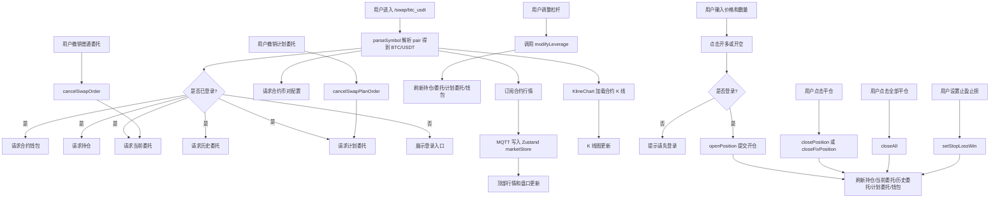

# 从开多开空到一键平仓：Next.js 合约交易页完整实践

在交易所前端里，合约交易页通常比现货交易页更复杂。

现货交易页主要围绕“买入资产、卖出资产、查看余额、管理委托”展开；而合约交易页不只是买卖资产本身，它还要处理杠杆、保证金、开多、开空、持仓、浮动盈亏、强平风险、止盈止损、计划委托和平仓等一整套交易链路。

这篇文章以一个 Next.js + React + TypeScript 的数字资产交易平台前端为例，讲清楚一个合约交易页应该如何设计：从交易对切换、行情联动，到开多开空、杠杆调整、持仓展示、止盈止损、平仓、一键平仓和计划委托管理。

先说明一下边界：这里讲的“合约交易”指交易所里的永续合约、保证金和多空持仓业务，不是钱包直连的链上智能合约读写。

---

## 一、为什么合约交易页比现货交易页更复杂

现货交易页主要处理：

```text
买入或卖出资产本身
查询余额
提交订单
撤销委托
查看当前委托和历史委托
展示行情和 K 线
```

合约交易页在这些基础上，又多了很多风险和状态：

```text
开多 / 开空
杠杆倍数
全仓 / 逐仓
保证金占用
持仓数量
开仓均价
浮动盈亏
收益率
强平价格
止盈止损
计划委托
平仓
一键平仓
```

这些功能的复杂点在于：用户提交一次操作后，影响的不只是一个列表。

例如：

- 开仓会占用保证金。
- 市价开仓可能马上形成持仓。
- 限价开仓可能先进入当前委托。
- 平仓会释放保证金，并结算盈亏。
- 止盈止损可能进入计划委托或条件单。
- 撤单会释放冻结保证金。
- 一键平仓可能同时影响多个持仓。

所以合约页不能只写一个表单提交接口，而要把 HTTP 请求、MQTT 行情、React Query、Zustand、表单状态、登录态和风险提示组合起来。

---

## 二、合约交易页由哪些模块组成

一个完整的合约交易页通常包括这些模块：

```text
交易对列表：切换 BTC/USDT、ETH/USDT 等合约
顶部行情：展示最新价、涨跌幅、24h 高低价
K 线图：展示历史 K 线和实时 K 线
盘口：展示买盘和卖盘
最新成交：展示实时成交记录
开仓区：支持开多、开空、限价、市价
杠杆设置：调整当前交易对杠杆
保证金模式：全仓 / 逐仓
持仓表格：展示多空仓位、盈亏、强平价
平仓操作：单仓平仓、平多、平空
一键平仓：快速平掉当前交易对持仓
止盈止损：围绕持仓设置风险控制
当前委托：展示普通未成交委托
历史委托：展示历史订单结果
计划委托：展示条件触发类委托
```

在项目结构上，可以把合约交易页拆成以下几类文件：

```text
src/app/(trading)/swap/[pair]/page.tsx
src/components/trading/kline-chart.tsx
src/components/trading/symbol-list.tsx
src/components/trading/symbol-picker.tsx
src/components/trading/depth-chart.tsx
src/hooks/use-market-subscribe.ts
src/lib/api/swap.ts
src/lib/api/market.ts
src/lib/api/finance.ts
src/lib/mqtt.ts
src/lib/symbol.ts
src/store/marketStore.ts
src/store/userStore.ts
```

如果继续做工程化拆分，还可以进一步补充：

```text
src/components/trading/swap-order-form.tsx
src/components/trading/position-table.tsx
src/components/trading/current-swap-orders.tsx
src/components/trading/history-swap-orders.tsx
src/components/trading/plan-orders.tsx
src/components/trading/tpsl-dialog.tsx
src/components/trading/leverage-dialog.tsx
src/hooks/useSwapBalance.ts
src/hooks/useSwapPositions.ts
src/hooks/useSwapOrders.ts
src/hooks/usePlaceSwapOrder.ts
src/hooks/useClosePosition.ts
src/hooks/useLeverage.ts
```

这样可以避免所有逻辑都堆在一个 `page.tsx` 里。

---

## 三、整体数据流流程图

合约交易页的数据流可以概括成下面这条链路：



这张图的重点是：**合约交易页的每一次交易操作，都会牵动多个数据模块刷新**。因此，合约页比普通业务页更依赖统一的 query invalidation 和状态分层。

---

## 四、合约交易页入口：从 URL 解析当前交易对

合约交易页通常使用动态路由承接交易对，例如：

```text
/swap/btc_usdt
```

页面中会先把 URL 参数转换成接口和行情系统使用的标准格式。

```tsx
/**
 * 文件位置：src/app/(trading)/swap/[pair]/page.tsx
 * 文件作用：合约交易页主入口，组合行情、K线、开仓、持仓、委托、计划委托、杠杆和平仓
 * 核心能力：
 * 1. 从 URL 解析当前合约交易对
 * 2. 请求合约配置、钱包、持仓、委托和计划委托
 * 3. 提供开多、开空、杠杆调整、止盈止损、平仓和一键平仓交互
 */
```

示例代码：

```tsx
const params = useParams<{ pair: string }>();
const currentSymbol = parseSymbol(params.pair);
const [coin, base] = currentSymbol.split("/");
```

如果用户访问：

```text
/swap/btc_usdt
```

则会得到：

```text
BTC/USDT
```

页面中还会维护一些合约交易相关的 UI 状态：

```tsx
const [marginMode, setMarginMode] = useState<"cross" | "isolated">("cross");
const [positionMode, setPositionMode] = useState<"hedge" | "oneway">("hedge");
const [leverage, setLeverage] = useState(25);
const [orderType, setOrderType] = useState<"market" | "limit" | "stop">(
  "market",
);
const [side, setSide] = useState<"long" | "short">("long");
const [price, setPrice] = useState("");
const [amount, setAmount] = useState("");
```

这些状态分别对应：

```text
marginMode：全仓 / 逐仓
positionMode：双向持仓 / 单向持仓
leverage：杠杆倍数
orderType：市价 / 限价 / 计划
side：开多 / 开空
price：委托价格
amount：委托数量或张数
```

---

## 五、交易对切换：URL、symbol 和 MQTT topic 如何统一

交易所项目里最容易混乱的地方之一，是同一个交易对在不同场景下有不同格式：

```text
URL 路由：btc_usdt
接口参数：BTC/USDT
MQTT topic：BTC-USDT
展示文本：BTC/USDT
```

如果每个页面自己处理字符串转换，项目很快会变乱。更好的方式是封装一个交易对工具文件。

```ts
/**
 * 文件位置：src/lib/symbol.ts
 * 文件作用：统一交易对格式，解决 URL、接口、MQTT topic 使用不同 symbol 格式的问题
 * 核心能力：
 * 1. btc_usdt / BTCUSDT / BTC-USDT / BTC/USDT 统一转为 BTC/USDT
 * 2. BTC/USDT 转为路由格式 btc_usdt
 * 3. BTC/USDT 转为 MQTT topic 后缀 BTC-USDT
 */
```

示例代码：

```ts
export function parseSymbol(raw: string | null | undefined): string {
  if (!raw) return "BTC/USDT";

  const upper = raw.toUpperCase().trim();

  if (upper.includes("/")) return upper;
  if (upper.includes("-")) return upper.replace("-", "/");
  if (upper.includes("_")) return upper.replace("_", "/");

  for (const quote of QUOTE_COINS) {
    if (upper.endsWith(quote) && upper.length > quote.length) {
      const base = upper.slice(0, -quote.length);
      return `${base}/${quote}`;
    }
  }

  return upper;
}

export function symbolToUrlPair(symbol: string): string {
  return symbol.toLowerCase().replace("/", "_");
}
```

交易对列表中，点击某个合约后可以这样跳转：

```tsx
const handleSelect = (symbol: string) => {
  const pair = symbolToUrlPair(symbol);
  router.push(`/swap/${pair}`);
  onSelect?.();
};
```

交易对切换后，相关 query 会因为 `queryKey` 变化而重新请求：

```tsx
["swapCoinInfo", currentSymbol][("swapPlate", currentSymbol)][
  ("swapLatestTrade", currentSymbol)
][("swapPositions", currentSymbol)][
  ("swapPlanOrders", currentSymbol, coinInfo?.id)
][("swapCurrentOrders", currentSymbol, coinInfo?.id)][
  ("swapHistoryOrders", currentSymbol, coinInfo?.id)
];
```

同时，行情订阅也会随着 symbol 变化重新执行 effect。旧 topic 会通过 cleanup 中的 `off()` 清理，新 topic 会重新订阅。

---

## 六、行情联动：盘口、成交、K 线如何服务合约下单

合约页需要实时行情来支撑交易判断：

```text
顶部行情：展示最新价、涨跌幅
盘口：辅助用户选择开仓价格
最新成交：观察短期成交方向
K 线：观察历史走势
```

项目中通过 `useMarketSubscribe` 订阅合约行情：

```ts
/**
 * 文件位置：src/hooks/use-market-subscribe.ts
 * 文件作用：行情订阅 hook，负责 HTTP 快照兜底和 MQTT 增量订阅
 * 核心能力：
 * 1. 根据 type 区分现货和合约 topic
 * 2. 订阅 thumb、盘口、成交
 * 3. 将数据写入 Zustand marketStore
 */
```

合约页调用：

```tsx
useMarketSubscribe({
  symbol: currentSymbol,
  type: "swap",
  subscribeThumb: true,
});
```

合约相关 topic 可以这样设计：

```ts
export const TOPIC_SWAP_THUMB_ALL = "contract-thumb/#";

export const topicSwapTrade = (symbol: string) =>
  `contract-trade-pc/${toSymbolKey(symbol)}`;

export const topicSwapPlate = (symbol: string) =>
  `contract-plate/${toSymbolKey(symbol)}`;

export const topicSwapKline = (symbol: string) =>
  `contract-kline/${toSymbolKey(symbol)}`;
```

页面读取 Zustand 中的行情：

```tsx
const thumb = useMarketStore(selectThumb(currentSymbol));
const platePushed = useMarketStore(selectPlate(currentSymbol));
```

同时也可以保留 HTTP 兜底盘口：

```tsx
const { data: plateFetched } = useQuery({
  queryKey: ["swapPlate", currentSymbol],
  queryFn: () => getSwapPlateFull({ symbol: currentSymbol }),
  refetchInterval: 2000,
});

const plate = platePushed ?? plateFetched;
```

这种模式很适合交易页：**MQTT 负责实时更新，HTTP 负责初始快照和兜底校准。**

K 线组件则可以直接复用现货页的图表组件，只是传入 `type="swap"`：

```tsx
<KlineChart symbol={currentSymbol} type="swap" height={450} />
```

K 线组件内部会调用合约 K 线接口，并订阅合约 K 线 topic。

---

## 七、合约交易和现货交易有什么区别

现货交易是买卖资产本身。

比如用户买入 BTC/USDT，账户里会得到 BTC；卖出 BTC/USDT，账户里会减少 BTC，增加 USDT。

合约交易不是这样。

合约交易的核心是围绕标的价格建立方向性仓位：

```text
开多：认为价格会上涨
开空：认为价格会下跌
平仓：结束已有仓位
```

它不一定代表用户真的持有 BTC，而是在交易 BTC/USDT 这个价格合约。

因此合约交易多了几个关键概念：

```text
杠杆：放大名义仓位
保证金：开仓所需抵押资金
持仓：已经成交并持续存在的仓位
浮动盈亏：随着行情变化实时变化
强平价：保证金不足时可能被强制平仓的价格
止盈止损：达到目标价或风险价时触发操作
计划委托：满足触发条件后再提交委托
```

这也是合约交易页比现货交易页复杂的根本原因。

---

## 八、开多和开空如何理解

开多和开空是合约交易最核心的两个动作。

### 开多

开多表示用户预期价格上涨。

如果 BTC 从 60,000 涨到 65,000，多仓会盈利。

在接口参数中，开多通常会对应：

```text
direction = BUY
positionSide = LONG
```

### 开空

开空表示用户预期价格下跌。

如果 BTC 从 60,000 跌到 55,000，空仓会盈利。

在接口参数中，开空通常会对应：

```text
direction = SELL
positionSide = SHORT
```

项目页面中通常用 UI 状态表示开多 / 开空：

```tsx
const [side, setSide] = useState<"long" | "short">("long");
```

提交时转换成接口字段：

```tsx
direction: side === "long" ? "BUY" : "SELL";
```

需要注意：合约里的 `BUY/SELL` 不等同于现货里的买入和卖出。现货买入是获得资产，合约开多是建立看涨仓位；现货卖出是卖出资产，合约开空是建立看跌仓位。

---

## 九、杠杆和保证金如何影响可开数量

杠杆的基本逻辑是：

```text
名义仓位 = 保证金 × 杠杆
保证金 ≈ 名义仓位 / 杠杆
```

假设用户有 100 USDT 保证金，使用 10x 杠杆，理论上可以控制约 1000 USDT 的名义仓位。

杠杆越高，所需初始保证金越少，但风险也越高。因为价格只要朝不利方向波动一点，保证金占比就会快速下降，强平价也会更接近开仓价。

项目里杠杆可以用本地 state 维护：

```tsx
const [leverage, setLeverage] = useState(25);
```

杠杆调整 UI 可以是 Dialog + Slider：

```tsx
<Slider
  value={[leverage]}
  onValueChange={([value]) => setLeverage(value)}
  max={125}
  min={1}
  step={1}
/>
```

提交杠杆：

```tsx
const leverageMut = useMutation({
  mutationFn: modifyLeverage,
  onSuccess: () => {
    toast.success("杠杆已调整");
    setShowLeverageModal(false);
    invalidatePositions();
  },
});
```

对应 API：

```ts
export const modifyLeverage = (data: { symbol: string; leverage: number }) =>
  fetcher.post<void>("/swap/order/modify-leverage", data);
```

可开数量可以根据可用保证金、杠杆、价格和合约面值估算：

```tsx
const available = wallet.availableBalance ?? wallet.balance ?? 0;
const orderPrice =
  orderType === "market" ? thumb?.close || 0 : parseFloat(price);
const shareValue = coinInfo?.shareNumber ?? 1;

const maxShare = (available * leverage) / (orderPrice * shareValue);
setAmount(Math.floor(maxShare * (percent / 100)).toString());
```

这个计算在前端只能做参考，最终可开数量和风险控制应该以后端返回为准。

---

## 十、合约下单表单：限价、市价、开多、开空如何组装参数

合约下单通常需要区分几个维度：

```text
开仓方向：开多 / 开空
订单类型：市价 / 限价
保证金模式：全仓 / 逐仓
杠杆倍数：1x、5x、10x、25x...
价格：限价单需要，市价单不需要
数量：合约张数或币数量
```

API 可以集中放在 `src/lib/api/swap.ts`：

```ts
/**
 * 文件位置：src/lib/api/swap.ts
 * 文件作用：合约交易 API 模块，封装开仓、平仓、持仓、委托、计划委托、杠杆和止盈止损接口
 * 核心能力：
 * 1. openPosition 开仓
 * 2. closePosition / closeFixPosition 平仓
 * 3. closeAll 一键平仓
 * 4. getTakePosition 查询持仓
 * 5. getSwapCurrentOrders / getSwapHistoryOrders / getSwapPlanOrders 查询委托
 */
```

开仓参数可以这样定义：

```ts
export interface OpenPositionPayload {
  symbol: string;
  direction: SwapDirection;
  type: SwapOrderType;
  price?: number;
  shareNumber: number;
  leverage: number;
  patterns: SwapPattern;
  entrustType: SwapEntrustType;
  stopLossPrice?: number;
  stopWinPrice?: number;
}
```

开仓接口：

```ts
export const openPosition = (data: OpenPositionPayload) =>
  fetcher.post<OpenPositionResult>("/swap/order/open", data);
```

页面提交前做基础校验：

```tsx
if (!isLogin) {
  toast.error("请先登录");
  return;
}

const share = Number(amount);

if (!Number.isFinite(share) || share <= 0) {
  toast.error("请输入正确数量");
  return;
}

const isLimitLike = orderType !== "market";
const priceVal = isLimitLike ? Number(price) : 0;

if (isLimitLike && (!Number.isFinite(priceVal) || priceVal <= 0)) {
  toast.error("请输入正确价格");
  return;
}
```

提交参数：

```tsx
openMut.mutate({
  symbol: currentSymbol,
  direction: side === "long" ? "BUY" : "SELL",
  type: orderType === "market" ? "MARKET_PRICE" : "LIMIT_PRICE",
  price: isLimitLike ? priceVal : undefined,
  shareNumber: share,
  leverage,
  patterns: marginMode === "cross" ? 1 : 0,
  entrustType: orderType === "market" ? 1 : 0,
});
```

这里的字段含义是：

```text
side = long  → direction = BUY
side = short → direction = SELL

orderType = market → type = MARKET_PRICE
orderType = limit  → type = LIMIT_PRICE

marginMode = cross    → patterns = 1，全仓
marginMode = isolated → patterns = 0，逐仓
```

如果页面中出现了 `orderType = "stop"`，需要特别注意：如果项目没有独立计划委托创建接口，而仍然复用 `openPosition`，就不能把它描述成完整的计划委托下单。更严谨的说法是：

```text
当前页面预留了计划类型入口，但创建计划委托的接口还可以进一步独立封装。
```

---

## 十一、合约余额和保证金如何读取

合约交易需要展示可用保证金。用户开仓前，需要知道自己还能用多少资金。

合约钱包查询可以这样写：

```tsx
const { data: walletList } = useQuery({
  queryKey: ["swapWallet"],
  queryFn: async () => {
    try {
      return await getSwapWallet({ type: "2" });
    } catch {
      return null;
    }
  },
  enabled: isLogin,
  refetchInterval: 8000,
});
```

对应 API：

```ts
export const getSwapWallet = (params?: {
  type?: string | number;
  rateStr?: string;
}) =>
  fetcher.get<any>(
    "/newbusiness/MemberWalletController/getWalletDetail",
    params,
  );
```

页面中可以兼容不同返回结构：

```tsx
const wallet = Array.isArray(walletList)
  ? walletList.find(
      (item: any) => item.coinName === base || item.coinUnit === base,
    )
  : walletList;
```

展示可用保证金：

```tsx
{
  isLogin
    ? (wallet?.availableBalance ?? wallet?.balance ?? 0).toFixed(2)
    : "--";
}
USDT;
```

这里有一个优化点：如果接口返回结构稳定，最好不要长期使用 `any`，应该补充 `SwapWallet` 类型。合约交易涉及保证金、冻结金额和未实现盈亏，类型越清晰，后续越不容易出错。

---

## 十二、持仓展示：多空方向、浮动盈亏和强平价

合约页最重要的表格不是委托表，而是持仓表。

持仓查询：

```tsx
const { data: allPositions = [] } = useQuery({
  queryKey: ["swapPositions", currentSymbol],
  queryFn: async () => {
    try {
      return (await getTakePosition({ symbol: currentSymbol })) ?? [];
    } catch {
      return [] as SwapPosition[];
    }
  },
  enabled: isLogin,
  refetchInterval: 5000,
});
```

对应 API：

```ts
export const getTakePosition = (params?: { symbol?: string }) =>
  fetcher.post<SwapPosition[]>("/swap/order/getTakePosition", params || {});
```

页面可以按持仓类型拆分普通仓位和跟单仓位：

```tsx
const positions = useMemo(
  () => allPositions.filter((position) => position.jointType !== 1),
  [allPositions],
);

const followPositions = useMemo(
  () => allPositions.filter((position) => position.jointType === 1),
  [allPositions],
);
```

持仓表格通常需要展示：

```text
合约
多空方向
杠杆
持仓数量
开仓均价
标记价格
保证金
未实现盈亏
收益率
强平价格
止盈止损按钮
平仓按钮
```

页面里可以这样判断多空：

```tsx
const isLong = position.direction === "BUY";
const markPrice = position.currentPrice ?? thumb?.close;
```

盈亏展示：

```tsx
{
  position.profit >= 0 ? "+" : "";
}
{
  position.profit.toFixed(2);
}

{
  typeof position.profitRate === "number" && (
    <span>
      ({position.profitRate >= 0 ? "+" : ""}
      {position.profitRate.toFixed(2)}%)
    </span>
  );
}
```

如果类型中已经有 `liquidationPrice`，建议在 UI 中展示强平价。强平价是合约交易中非常关键的风险指标，不能只隐藏在类型里。

---

## 十三、平仓和一键平仓如何实现

合约交易里，开仓只是开始，平仓才是结束持仓。

项目中可以有三类平仓能力。

### 1. 单个持仓平仓

```tsx
const closeMut = useMutation({
  mutationFn: ({ position }: { position: SwapPosition }) =>
    position.patterns === 0
      ? closeFixPosition({ orderId: String(position.id) })
      : closePosition({ orderId: String(position.id) }),
  onSuccess: () => {
    toast.success("平仓已提交");
    invalidatePositions();
  },
});
```

对应 API：

```ts
export const closePosition = (data: { orderId: string; amount?: number }) =>
  fetcher.post<void>("/swap/order/close", data);

export const closeFixPosition = (data: { orderId: string; amount?: number }) =>
  fetcher.post<void>("/swap/order/closeFix", data);
```

这里根据 `patterns` 区分全仓和平仓接口：

```text
patterns = 0 → 逐仓 → closeFixPosition
patterns = 1 → 全仓 → closePosition
```

当前这种实现更接近“一键平掉当前仓位”，没有单独输入平仓数量和限价平仓价格。如果 API 已经支持 `amount?: number`，后续可以扩展成部分平仓。

### 2. 快捷平多 / 平空

页面可以找到当前 symbol 下的多仓或空仓：

```tsx
const longPosition = positions.find((position) => position.direction === "BUY");

if (longPosition) {
  closeMut.mutate({ position: longPosition });
} else {
  toast.error("无多单");
}
```

平空同理：

```tsx
const shortPosition = positions.find(
  (position) => position.direction === "SELL",
);

if (shortPosition) {
  closeMut.mutate({ position: shortPosition });
} else {
  toast.error("无空单");
}
```

### 3. 一键平仓

一键平仓可以通过专门接口实现：

```tsx
const closeAllMut = useMutation({
  mutationFn: () => closeAll({ symbol: currentSymbol }),
  onSuccess: () => {
    toast.success("一键平仓已提交");
    invalidatePositions();
  },
});
```

对应 API：

```ts
export const closeAll = (data?: { symbol?: string }) =>
  fetcher.post<void>("/swap/order/closeAll", data || {});
```

如果传了：

```ts
{
  symbol: currentSymbol;
}
```

通常表示平当前交易对，而不是平所有合约。

对于平仓、一键平仓这类高风险操作，建议加二次确认，并处理 loading 状态，避免重复点击。

---

## 十四、止盈止损如何设计

止盈止损可以理解为围绕持仓设置的风险控制条件。

例如：

```text
价格涨到 68,000 时止盈
价格跌到 59,000 时止损
```

在页面上，止盈止损入口通常放在持仓表格中：

```tsx
<Button
  onClick={() => {
    setStopTarget(position);
    setStopLossPrice(
      position.stopLossPrice ? String(position.stopLossPrice) : "",
    );
    setStopWinPrice(position.stopWinPrice ? String(position.stopWinPrice) : "");
  }}
>
  止盈止损
</Button>
```

打开弹窗后，用户填写：

```text
止盈价
止损价
```

提交逻辑：

```tsx
const handleSubmitStop = () => {
  if (!stopTarget) return;

  const stopLoss = stopLossPrice ? Number(stopLossPrice) : undefined;
  const stopWin = stopWinPrice ? Number(stopWinPrice) : undefined;

  if (stopLoss == null && stopWin == null) {
    toast.error("请至少填一个");
    return;
  }

  stopMut.mutate({
    orderId: String(stopTarget.id),
    stopLossPrice: stopLoss,
    stopWinPrice: stopWin,
  });
};
```

对应 API：

```ts
export const setStopLossWin = (data: {
  orderId: string;
  stopLossPrice?: number;
  stopWinPrice?: number;
}) => fetcher.post<void>("/swap/order/addOrderToOpenWinOrLoseOrderList", data);
```

成功后刷新：

```tsx
toast.success("止盈止损已设置");
setStopTarget(null);
setStopLossPrice("");
setStopWinPrice("");
invalidatePositions();
```

这里的实现属于“持仓上设置 TP/SL”，而不是“下单时附带 TP/SL”。如果后续要做得更完整，可以补充：

```text
下单时附带止盈止损
展示已有止盈止损
取消止盈止损
止盈止损作为计划委托的一类展示
```

---

## 十五、计划委托如何设计

计划委托和普通委托的区别是：普通委托提交后立即进入订单系统；计划委托需要满足触发条件后，才会生成正式委托。

计划委托通常包含：

```text
触发价
委托价
方向
数量
杠杆
订单类型
状态
撤销操作
```

查询计划委托：

```tsx
const { data: planOrders = [] } = useQuery({
  queryKey: ["swapPlanOrders", currentSymbol, coinInfo?.id],
  queryFn: async () => {
    const result = await getSwapPlanOrders({
      symbol: currentSymbol,
      contractCoinId: coinInfo?.id,
      pageNo: 1,
      pageSize: 50,
    });

    if (Array.isArray(result)) return result;
    return result?.content ?? [];
  },
  enabled: isLogin && !!coinInfo?.id,
  refetchInterval: 5000,
});
```

对应 API：

```ts
export const getSwapPlanOrders = (params?: {
  symbol?: string;
  contractCoinId?: string | number;
  pageNo?: number;
  pageSize?: number;
}) =>
  fetcher.post<PageResult<SwapPlanOrder> | SwapPlanOrder[]>(
    "/swap/order/getSpotAll",
    params || {},
  );
```

撤销计划委托：

```tsx
const cancelPlanMut = useMutation({
  mutationFn: cancelSwapPlanOrder,
  onSuccess: () => {
    toast.success("撤销成功");
    queryClient.invalidateQueries({ queryKey: ["swapPlanOrders"] });
  },
});
```

对应 API：

```ts
export const cancelSwapPlanOrder = (data: { orderId: string | number }) =>
  fetcher.post<void>("/swap/order/cancelSpotOrder", data);
```

如果页面里已经有计划委托列表和撤销，但没有独立的计划委托创建接口，那么更准确的描述是：

```text
当前已支持计划委托列表展示和撤销；创建计划委托的表单和接口还可以进一步独立封装。
```

---

## 十六、当前委托、历史委托和计划委托如何刷新

合约页中，很多操作都会影响多个列表。比较好的做法是统一封装一个刷新函数：

```tsx
const invalidatePositions = () => {
  queryClient.invalidateQueries({ queryKey: ["swapPositions"] });
  queryClient.invalidateQueries({ queryKey: ["swapCurrentOrders"] });
  queryClient.invalidateQueries({ queryKey: ["swapHistoryOrders"] });
  queryClient.invalidateQueries({ queryKey: ["swapPlanOrders"] });
  queryClient.invalidateQueries({ queryKey: ["swapWallet"] });
};
```

开仓成功后：

```tsx
toast.success("开仓委托已提交");
setAmount("");
invalidatePositions();
```

平仓成功后：

```tsx
toast.success("平仓已提交");
invalidatePositions();
```

一键平仓成功后：

```tsx
toast.success("一键平仓已提交");
invalidatePositions();
```

止盈止损成功后：

```tsx
toast.success("止盈止损已设置");
invalidatePositions();
```

普通委托撤单成功后，除了刷新当前委托，也建议刷新钱包、历史委托和持仓。因为撤单可能释放冻结保证金，也可能影响历史记录。

计划委托撤销成功后，至少要刷新计划委托列表。如果后端把计划委托撤销记录也计入历史委托，也可以同步刷新历史委托。

---

## 十七、React Query、Zustand、MQTT、表单 state 的分工

合约页里状态很多，如果全部塞进 `useState`，页面会非常难维护。

比较合理的分工是：

| 数据                   | 适合工具                   | 原因                       |
| ---------------------- | -------------------------- | -------------------------- |
| 24h 行情               | Zustand + MQTT             | 高频共享行情               |
| 盘口                   | Zustand + MQTT + HTTP 兜底 | 实时推送优先，HTTP 校准    |
| 最新成交               | MQTT / React Query 兜底    | 高频数据，可逐步切到 store |
| K 线                   | klinecharts + MQTT         | 图表实例内部更新更高效     |
| 合约配置               | React Query                | 服务端配置，低频更新       |
| 钱包保证金             | React Query                | 服务端状态，需要刷新       |
| 持仓                   | React Query                | 开平仓后需要刷新           |
| 当前委托               | React Query                | 可撤单，需要刷新           |
| 历史委托               | React Query                | 订单结果记录               |
| 计划委托               | React Query                | 条件单列表                 |
| 杠杆、方向、价格、数量 | useState / react-hook-form | 页面局部表单状态           |
| 登录态                 | userStore                  | 全局用户状态               |

一句话总结：

```text
行情这种高频共享数据放 MQTT + Zustand，
余额、持仓和委托这种服务端状态放 React Query，
开仓方向、杠杆弹窗、止盈止损弹窗这些局部交互状态放组件 state。
```

这类状态分层，是交易页保持可维护性的关键。

---

## 十八、金融数值精度和风险提示如何处理

合约交易涉及金额、保证金、盈亏、杠杆、强平价等计算，不建议长期依赖 JavaScript 普通浮点数。

例如：

```ts
0.1 + 0.2; // 0.30000000000000004
```

如果用 `Number`、`parseFloat` 和普通乘法做保证金或盈亏计算，可能会出现精度误差。

更稳妥的方式是使用：

```text
decimal.js
big.js
bignumber.js
```

并遵循几个原则：

```text
金额和数量计算使用高精度库
提交给后端前尽量用字符串
展示时按 priceScale / amountScale 格式化
可开数量和强平价前端只做参考
最终风控结果以后端为准
```

合约配置中如果已经有这些字段：

```text
leverageMultiple
minShare
maxShare
shareNumber
maintenanceMarginRate
feePercent
```

就应该用于：

```text
限制最大杠杆
校验最小张数
校验最大张数
计算合约面值
展示维持保证金率
展示手续费提示
```

当前如果还没有完整风控逻辑，后续可以补充：

```text
最小下单张数校验
最大下单张数校验
限价价格保护
reduceOnly
强平风险提示
KYC / 风险确认 / 合约开通判断
```

---

## 十九、从 0 搭建合约交易页应该怎么写

下面是一套更工程化的拆分方式。

### 第一步：定义合约交易类型

```ts
// src/types/swap.ts
export interface SwapSymbol {
  id: number;
  symbol: string;
  coinSymbol: string;
  baseSymbol: string;
  priceScale: number;
  amountScale: number;
  maxLeverage: number;
  minShare: number;
  maxShare: number;
  contractSize: number;
}

export type PositionSide = "LONG" | "SHORT";
export type OrderSide = "BUY" | "SELL";
export type SwapOrderType = "LIMIT" | "MARKET";
export type MarginMode = "CROSSED" | "ISOLATED";

export interface PlaceSwapOrderParams {
  symbol: string;
  side: OrderSide;
  positionSide: PositionSide;
  orderType: SwapOrderType;
  price?: string;
  volume: string;
  leverage: number;
  marginMode: MarginMode;
}

export interface SwapBalanceInfo {
  coinUnit: string;
  balance: string;
  availableBalance: string;
  frozenBalance: string;
  margin?: string;
  unrealizedPnl?: string;
}

export interface SwapPosition {
  id: string;
  symbol: string;
  positionSide: PositionSide;
  leverage: number;
  openPrice: string;
  markPrice: string;
  volume: string;
  availableVolume: string;
  margin: string;
  unrealizedPnl: string;
  profitRate: string;
  liquidationPrice?: string;
}

export interface SwapCurrentOrder {
  orderId: string;
  symbol: string;
  side: OrderSide;
  orderType: SwapOrderType;
  price: string;
  volume: string;
  tradedVolume: string;
  status: number;
}

export interface SwapHistoryOrder extends SwapCurrentOrder {
  completedTime?: number;
}

export interface PlanOrder {
  id: string;
  symbol: string;
  side: OrderSide;
  triggerPrice: string;
  orderPrice?: string;
  volume: string;
  status: number;
}

export interface CancelSwapOrderParams {
  orderId: string;
}

export interface ClosePositionParams {
  positionId: string;
  volume?: string;
  orderType?: SwapOrderType;
  price?: string;
}

export interface AdjustLeverageParams {
  symbol: string;
  leverage: number;
}

export interface TakeProfitStopLossParams {
  positionId: string;
  takeProfitPrice?: string;
  stopLossPrice?: string;
}
```

### 第二步：封装合约交易 API

```ts
// src/services/swap-trade.ts
import {
  getSwapWallet,
  getTakePosition,
  openPosition,
  closePosition,
  closeFixPosition,
  closeAll,
  modifyLeverage,
  setStopLossWin,
  getSwapCurrentOrders,
  getSwapHistoryOrders,
  getSwapPlanOrders,
  cancelSwapOrder,
  cancelSwapPlanOrder,
} from "@/lib/api/swap";

export function getSwapBalance() {
  return getSwapWallet({ type: "2" });
}

export function getSwapPositions(symbol: string) {
  return getTakePosition({ symbol });
}

export function placeSwapOrder(params: Parameters<typeof openPosition>[0]) {
  return openPosition(params);
}

export function closeSwapPosition(orderId: string, isolated: boolean) {
  return isolated ? closeFixPosition({ orderId }) : closePosition({ orderId });
}

export function closeAllPositions(symbol: string) {
  return closeAll({ symbol });
}

export function adjustLeverage(symbol: string, leverage: number) {
  return modifyLeverage({ symbol, leverage });
}

export function setTakeProfitStopLoss(params: {
  orderId: string;
  stopLossPrice?: number;
  stopWinPrice?: number;
}) {
  return setStopLossWin(params);
}

export function getSwapCurrentOrderList(
  symbol: string,
  contractCoinId?: number,
) {
  return getSwapCurrentOrders({
    symbol,
    contractCoinId,
    pageNo: 1,
    pageSize: 20,
  });
}

export function getSwapHistoryOrderList(
  symbol: string,
  contractCoinId?: number,
) {
  return getSwapHistoryOrders({
    symbol,
    contractCoinId,
    pageNo: 1,
    pageSize: 20,
  });
}

export function getPlanOrders(symbol: string, contractCoinId?: number) {
  return getSwapPlanOrders({
    symbol,
    contractCoinId,
    pageNo: 1,
    pageSize: 50,
  });
}

export function cancelNormalSwapOrder(orderId: string) {
  return cancelSwapOrder({ orderId });
}

export function cancelPlanOrder(orderId: string | number) {
  return cancelSwapPlanOrder({ orderId });
}
```

### 第三步：封装合约余额 hook

```ts
// src/hooks/useSwapBalance.ts
import { useQuery } from "@tanstack/react-query";
import { getSwapWallet } from "@/lib/api/swap";
import { parseSymbol } from "@/lib/symbol";
import { useUserStore } from "@/store/userStore";

export function useSwapBalance(symbol: string) {
  const { isLogin } = useUserStore();
  const [, quote] = parseSymbol(symbol).split("/");

  return useQuery({
    queryKey: ["swapWallet", quote],
    queryFn: async () => {
      const result = await getSwapWallet({ type: "2" });

      if (Array.isArray(result)) {
        return result.find(
          (item: any) => item.coinUnit === quote || item.coinName === quote,
        );
      }

      return result;
    },
    enabled: isLogin && Boolean(symbol),
    refetchInterval: 8000,
  });
}
```

### 第四步：封装持仓 hook

```ts
// src/hooks/useSwapPositions.ts
import { useQuery } from "@tanstack/react-query";
import { getTakePosition } from "@/lib/api/swap";
import { useUserStore } from "@/store/userStore";

export function useSwapPositions(symbol: string) {
  const { isLogin } = useUserStore();

  return useQuery({
    queryKey: ["swapPositions", symbol],
    queryFn: () => getTakePosition({ symbol }),
    enabled: isLogin && Boolean(symbol),
    refetchInterval: 5000,
  });
}
```

### 第五步：封装当前委托 hook

```ts
// src/hooks/useSwapCurrentOrders.ts
import { useQuery } from "@tanstack/react-query";
import { getSwapCurrentOrders } from "@/lib/api/swap";
import { useUserStore } from "@/store/userStore";

export function useSwapCurrentOrders(symbol: string, contractCoinId?: number) {
  const { isLogin } = useUserStore();

  return useQuery({
    queryKey: ["swapCurrentOrders", symbol, contractCoinId],
    queryFn: () =>
      getSwapCurrentOrders({
        symbol,
        contractCoinId,
        pageNo: 1,
        pageSize: 20,
      }),
    enabled: isLogin && Boolean(symbol) && Boolean(contractCoinId),
    refetchInterval: 5000,
  });
}
```

### 第六步：封装历史委托 hook

```ts
// src/hooks/useSwapHistoryOrders.ts
import { useQuery } from "@tanstack/react-query";
import { getSwapHistoryOrders } from "@/lib/api/swap";
import { useUserStore } from "@/store/userStore";

export function useSwapHistoryOrders(symbol: string, contractCoinId?: number) {
  const { isLogin } = useUserStore();

  return useQuery({
    queryKey: ["swapHistoryOrders", symbol, contractCoinId],
    queryFn: () =>
      getSwapHistoryOrders({
        symbol,
        contractCoinId,
        pageNo: 1,
        pageSize: 20,
      }),
    enabled: isLogin && Boolean(symbol) && Boolean(contractCoinId),
  });
}
```

### 第七步：封装计划委托 hook

```ts
// src/hooks/usePlanOrders.ts
import { useQuery } from "@tanstack/react-query";
import { getSwapPlanOrders, type SwapPlanOrder } from "@/lib/api/swap";
import { useUserStore } from "@/store/userStore";

export function usePlanOrders(symbol: string, contractCoinId?: number) {
  const { isLogin } = useUserStore();

  return useQuery({
    queryKey: ["swapPlanOrders", symbol, contractCoinId],
    queryFn: async () => {
      const result = await getSwapPlanOrders({
        symbol,
        contractCoinId,
        pageNo: 1,
        pageSize: 50,
      });

      if (Array.isArray(result)) return result;

      return result?.content ?? ([] as SwapPlanOrder[]);
    },
    enabled: isLogin && Boolean(symbol) && Boolean(contractCoinId),
    refetchInterval: 5000,
  });
}
```

### 第八步：封装开仓 mutation

```ts
// src/hooks/usePlaceSwapOrder.ts
import { useMutation, useQueryClient } from "@tanstack/react-query";
import { openPosition, type OpenPositionPayload } from "@/lib/api/swap";
import { toast } from "sonner";

export function usePlaceSwapOrder(symbol: string) {
  const queryClient = useQueryClient();

  function invalidate() {
    queryClient.invalidateQueries({ queryKey: ["swapPositions", symbol] });
    queryClient.invalidateQueries({ queryKey: ["swapCurrentOrders", symbol] });
    queryClient.invalidateQueries({ queryKey: ["swapHistoryOrders", symbol] });
    queryClient.invalidateQueries({ queryKey: ["swapPlanOrders", symbol] });
    queryClient.invalidateQueries({ queryKey: ["swapWallet"] });
  }

  return useMutation({
    mutationFn: (params: OpenPositionPayload) => openPosition(params),
    onSuccess: () => {
      toast.success("开仓委托已提交");
      invalidate();
    },
    onError: (error: Error) => {
      toast.error(error.message || "开仓失败");
    },
  });
}
```

### 第九步：封装平仓 mutation

```ts
// src/hooks/useClosePosition.ts
import { useMutation, useQueryClient } from "@tanstack/react-query";
import {
  closeFixPosition,
  closePosition,
  type SwapPosition,
} from "@/lib/api/swap";
import { toast } from "sonner";

export function useClosePosition(symbol: string) {
  const queryClient = useQueryClient();

  return useMutation({
    mutationFn: (position: SwapPosition) => {
      const orderId = String(position.id);

      return position.patterns === 0
        ? closeFixPosition({ orderId })
        : closePosition({ orderId });
    },
    onSuccess: () => {
      toast.success("平仓已提交");
      queryClient.invalidateQueries({ queryKey: ["swapPositions", symbol] });
      queryClient.invalidateQueries({
        queryKey: ["swapHistoryOrders", symbol],
      });
      queryClient.invalidateQueries({ queryKey: ["swapWallet"] });
    },
    onError: (error: Error) => {
      toast.error(error.message || "平仓失败");
    },
  });
}
```

### 第十步：封装一键平仓 mutation

```ts
// src/hooks/useCloseAllPositions.ts
import { useMutation, useQueryClient } from "@tanstack/react-query";
import { closeAll } from "@/lib/api/swap";
import { toast } from "sonner";

export function useCloseAllPositions(symbol: string) {
  const queryClient = useQueryClient();

  return useMutation({
    mutationFn: () => closeAll({ symbol }),
    onSuccess: () => {
      toast.success("一键平仓已提交");
      queryClient.invalidateQueries({ queryKey: ["swapPositions", symbol] });
      queryClient.invalidateQueries({
        queryKey: ["swapHistoryOrders", symbol],
      });
      queryClient.invalidateQueries({ queryKey: ["swapWallet"] });
    },
    onError: (error: Error) => {
      toast.error(error.message || "一键平仓失败");
    },
  });
}
```

### 第十一步：封装调整杠杆 mutation

```ts
// src/hooks/useAdjustLeverage.ts
import { useMutation, useQueryClient } from "@tanstack/react-query";
import { modifyLeverage } from "@/lib/api/swap";
import { toast } from "sonner";

export function useAdjustLeverage(symbol: string) {
  const queryClient = useQueryClient();

  return useMutation({
    mutationFn: (leverage: number) => modifyLeverage({ symbol, leverage }),
    onSuccess: () => {
      toast.success("杠杆已调整");
      queryClient.invalidateQueries({ queryKey: ["swapPositions", symbol] });
      queryClient.invalidateQueries({ queryKey: ["swapWallet"] });
    },
    onError: (error: Error) => {
      toast.error(error.message || "调整杠杆失败");
    },
  });
}
```

### 第十二步：封装止盈止损 mutation

```ts
// src/hooks/useTakeProfitStopLoss.ts
import { useMutation, useQueryClient } from "@tanstack/react-query";
import { setStopLossWin } from "@/lib/api/swap";
import { toast } from "sonner";

export function useTakeProfitStopLoss(symbol: string) {
  const queryClient = useQueryClient();

  return useMutation({
    mutationFn: setStopLossWin,
    onSuccess: () => {
      toast.success("止盈止损已设置");
      queryClient.invalidateQueries({ queryKey: ["swapPositions", symbol] });
      queryClient.invalidateQueries({ queryKey: ["swapPlanOrders", symbol] });
    },
    onError: (error: Error) => {
      toast.error(error.message || "设置失败");
    },
  });
}
```

---

## 二十、为什么开仓、平仓、止盈止损后要刷新余额、持仓和委托

合约交易里的一个核心原则是：**交易成功后不能只 toast。**

因为一次操作会影响多个数据源：

```text
开仓：占用保证金，可能生成持仓，也可能进入当前委托
平仓：释放保证金，产生盈亏，影响持仓和历史委托
止盈止损：可能影响持仓，也可能进入计划委托
撤单：释放冻结保证金，影响当前委托和历史记录
一键平仓：可能同时影响多个仓位
```

所以开仓、平仓、止盈止损、一键平仓成功后，应该统一刷新：

```tsx
queryClient.invalidateQueries({ queryKey: ["swapPositions"] });
queryClient.invalidateQueries({ queryKey: ["swapCurrentOrders"] });
queryClient.invalidateQueries({ queryKey: ["swapHistoryOrders"] });
queryClient.invalidateQueries({ queryKey: ["swapPlanOrders"] });
queryClient.invalidateQueries({ queryKey: ["swapWallet"] });
```

这也是合约页和普通业务页最大的区别之一：**它的操作结果不是一个接口返回就结束，而是要驱动整套交易状态同步更新。**

---

## 二十一、当前方案做得好的地方

这类合约交易页有几个值得保留的工程点。

第一，核心交易功能覆盖比较完整。
页面已经覆盖开多、开空、杠杆调整、持仓展示、止盈止损、平仓、一键平仓、计划委托列表、当前委托和历史委托。

第二，交易对格式有统一入口。
`src/lib/symbol.ts` 收敛了 URL、接口参数和 MQTT topic 的格式差异，避免页面里到处写字符串转换。

第三，行情链路已经接入 MQTT + Zustand。
合约页可以优先使用 `marketStore` 中的 thumb 和 plate，同时保留 HTTP 轮询兜底。

第四，合约 API 按业务集中封装。
`src/lib/api/swap.ts` 覆盖了开仓、平仓、杠杆、持仓、委托、计划委托和止盈止损等核心接口。

第五，登录态控制明确。
钱包、持仓、委托、计划委托都通过 `enabled: isLogin` 控制，未登录时不会请求私有接口。

第六，交易成功后有统一刷新意识。
开仓、平仓、一键平仓、止盈止损、杠杆调整后会刷新持仓、委托、计划委托和钱包，这是合约页非常重要的工程习惯。

---

## 二十二、后续可以优化的地方

第一，拆分页面组件。
当前合约页逻辑较集中，后续可以拆出下单表单、持仓表、当前委托表、历史委托表、计划委托表、杠杆弹窗和止盈止损弹窗。

第二，抽离交易 hooks。
可以新增 `useSwapBalance`、`useSwapPositions`、`useSwapCurrentOrders`、`usePlaceSwapOrder`、`useClosePosition` 等 hooks，降低页面复杂度。

第三，完善计划委托创建。
当前已有计划委托列表和撤销，但创建计划委托的表单和接口可以进一步独立封装。

第四，杠杆选项应来自接口。
如果合约配置里有 `leverageMultiple`，就不建议长期写死到 125 倍。

第五，保证金模式切换应真正接入接口。
如果后端已有 `switchPattern` 和 `canSwitchPattern`，页面里的全仓/逐仓切换就不应该只改本地 state。

第六，补充强平价和风险指标展示。
强平价、保证金率、风险率是合约交易的核心风险信息，建议在持仓表和下单区中明确展示。

第七，补充完整风控校验。
可以基于 `minShare`、`maxShare`、`maintenanceMarginRate`、`feePercent` 等字段做下单校验和风险提示。

第八，使用高精度库处理金融计算。
建议引入 `decimal.js` 或 `big.js`，避免保证金、盈亏、可开数量计算出现浮点误差。

第九，普通撤单后刷新范围可以扩大。
当前如果普通委托撤单只刷新当前委托，建议同时刷新钱包、历史委托和持仓。

第十，高风险操作增加确认弹窗。
平仓、一键平仓、撤单、调整杠杆都属于高风险操作，最好增加二次确认和 loading 防重复提交。

---

## 二十三、总结

合约交易页的核心链路可以概括为：

```text
用户进入 /swap/[pair]
        ↓
parseSymbol 统一交易对格式
        ↓
订阅合约行情，加载 K 线、盘口、成交
        ↓
登录后请求合约钱包、持仓、当前委托、历史委托和计划委托
        ↓
用户选择开多 / 开空，设置杠杆、价格和数量
        ↓
openPosition 提交开仓
        ↓
成功后刷新持仓、委托、计划委托和钱包
        ↓
用户设置止盈止损、平仓或一键平仓
        ↓
再次刷新交易相关状态
```

这个页面的工程难点不在于某一个接口，而在于把这些模块分层组织清楚：

```text
交易对路由：决定当前 symbol
行情系统：提供价格、盘口、成交和 K 线
合约配置：提供杠杆、精度、面值和风控参数
钱包保证金：决定可开仓位
开仓表单：处理开多、开空、市价、限价和杠杆
持仓表格：展示多空仓位、盈亏和风险
止盈止损：围绕持仓设置风险控制
计划委托：管理条件触发类订单
平仓逻辑：结束持仓并释放保证金
React Query：管理服务端状态和操作后的刷新
Zustand + MQTT：管理高频实时行情
组件 state：管理局部表单和弹窗状态
```

面试或项目复盘时，可以这样总结：

> 这个合约交易页比现货页复杂，因为它不只是买卖资产，还要处理杠杆、保证金、持仓、强平风险、止盈止损和计划委托。项目里通过 App Router 的 `/swap/[pair]` 承接交易对路由，用 `parseSymbol` 统一 symbol 格式；行情层使用 MQTT + Zustand，盘口保留 HTTP 轮询兜底；余额、持仓和委托用 React Query 管理，因为这些都是服务端状态，需要在开仓、平仓、撤单、调整杠杆后统一 invalidate。开仓时根据开多/开空转换成 `BUY/SELL`，根据市价/限价转换成 `MARKET_PRICE/LIMIT_PRICE`，同时带上杠杆和全仓/逐仓模式。整个页面的关键，是把高频行情、服务端状态、局部表单状态和交易成功后的联动刷新分清楚。

一句话总结：

**合约交易页的难点不只是开多开空，而是把行情、杠杆、保证金、持仓、委托、止盈止损、平仓和风险控制串成一条稳定、清晰、可维护的数据链路。**
