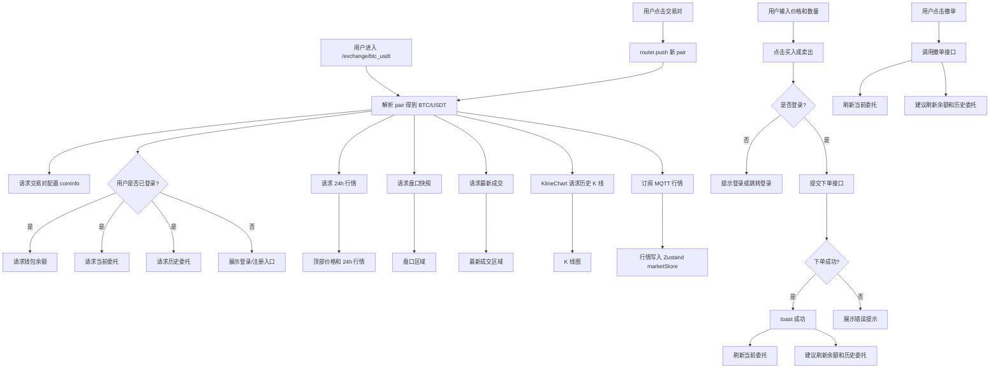

# 从交易对切换到下单撤单：Next.js 现货交易页完整实践

在交易所前端里，现货交易页通常是业务复杂度最高的页面之一。

它不是一个普通的表单页，也不是一个简单的数据展示页。一个完整的现货交易页，往往同时连接了行情系统、钱包资产、订单委托、用户登录态、K 线图、盘口、最新成交、下单表单和撤单逻辑。

用户进入 BTC/USDT 交易页后，页面不仅要展示实时行情，还要能完成买入、卖出、查看余额、查看当前委托、查看历史委托、撤销订单等操作。与此同时，交易对切换后，行情、K 线、盘口、成交、余额和委托数据都需要跟着变化。

这篇文章以一个 Next.js + React + TypeScript 的数字资产交易平台前端为例，讲清楚一个现货交易页应该如何设计：从交易对切换、行情联动，到限价/市价下单、余额读取、当前委托、历史委托和撤单完整链路。

---

## 一、为什么现货交易页比普通业务页复杂

普通业务页通常是：

```text
打开页面 → 请求数据 → 填写表单 → 提交 → 展示结果
```

但现货交易页不是这样。它同时处理多种状态：

1. **行情状态**
   最新价、涨跌幅、盘口、成交、K 线都需要实时更新。

2. **资产状态**
   买入时要看计价币余额，例如 USDT；卖出时要看交易币余额，例如 BTC。

3. **订单状态**
   当前委托、历史委托、撤单、成交状态都要展示和刷新。

4. **表单状态**
   买入/卖出、限价/市价、价格、数量、百分比快捷选择都属于局部交互状态。

5. **用户状态**
   未登录时不能下单，也不应该请求余额和委托接口。

6. **路由状态**
   URL 中的交易对变化后，整页相关数据都要重新加载或重新订阅。

所以现货交易页不能只靠一个 `useState` 写到底。更合理的分工是：

```text
React Query：管理余额、委托、交易对配置等服务端状态
Zustand：管理实时行情这类高频共享状态
MQTT：接收盘口、成交、K 线、24h 行情推送
组件 state：管理下单表单、tab、输入框等局部 UI 状态
Next.js Router：管理交易对切换
```

这也是交易页工程化的核心：**不同类型的状态，要放在不同的位置。**

---

## 二、现货交易页由哪些模块组成

一个完整的现货交易页通常包含以下模块：

```text
交易对列表：用于切换 BTC/USDT、ETH/USDT 等交易对
顶部行情：展示最新价、涨跌幅、24h 高低价和成交量
K 线图：展示历史走势和实时 candle
盘口：展示买盘和卖盘
最新成交：展示实时成交记录
下单区：支持限价/市价、买入/卖出
余额区：展示当前可用余额
当前委托：展示未成交或部分成交订单
历史委托：展示已成交、已撤销等历史订单
撤单操作：取消当前委托中的订单
```

在项目中，现货交易页入口可以设计为：

```tsx
/**
 * 文件位置：src/app/(trading)/exchange/[pair]/page.tsx
 * 文件作用：现货交易页入口，负责组合交易对、行情、K 线、盘口、成交、下单、委托和撤单
 * 核心能力：
 * 1. 从 URL 解析当前交易对
 * 2. 请求行情、钱包、委托和交易对配置
 * 3. 渲染 K 线、盘口、成交、下单面板和委托列表
 */
```

配套模块可以包括：

```text
src/components/trading/kline-chart.tsx
src/components/trading/symbol-list.tsx
src/components/trading/symbol-picker.tsx
src/components/trading/depth-chart.tsx
src/hooks/use-market-subscribe.ts
src/lib/api/exchange.ts
src/lib/api/market.ts
src/lib/api/finance.ts
src/lib/mqtt.ts
src/lib/symbol.ts
src/store/marketStore.ts
src/store/userStore.ts
```

如果后续继续优化，还可以把交易页拆得更细：

```text
src/components/trading/spot-order-form.tsx
src/components/trading/current-orders.tsx
src/components/trading/history-orders.tsx
src/hooks/useSpotBalance.ts
src/hooks/useCurrentOrders.ts
src/hooks/useHistoryOrders.ts
src/hooks/usePlaceSpotOrder.ts
src/hooks/useCancelSpotOrder.ts
```

这样可以避免交易页 `page.tsx` 越写越大。

---

## 三、整体数据流流程图

先看一张完整流程图：



这张图里最重要的是：**交易页是一个多数据源页面**。行情来自 HTTP + MQTT，余额和委托来自 HTTP，登录态来自 userStore，表单输入来自本地 state。

---

## 四、交易对切换：URL、symbol 和 MQTT topic 如何统一

交易所项目里很容易混乱的一点是：同一个交易对在不同地方可能有不同格式。

比如 BTC/USDT 可能出现为：

```text
URL 路由：btc_usdt
接口参数：BTC/USDT
MQTT topic：BTC-USDT
展示文本：BTC/USDT
```

如果不统一处理，页面里会到处写字符串转换，后期非常难维护。

更好的方式是封装一个交易对工具文件：

```ts
/**
 * 文件位置：src/lib/symbol.ts
 * 文件作用：统一交易对格式，解决 URL、接口、MQTT topic 使用不同 symbol 格式的问题
 * 核心能力：
 * 1. btc_usdt / BTCUSDT / BTC-USDT / BTC/USDT 统一转成 BTC/USDT
 * 2. BTC/USDT 转成路由格式 btc_usdt
 * 3. BTC/USDT 转成 MQTT topic 后缀 BTC-USDT
 */
```

示例代码：

```ts
// src/lib/symbol.ts
const QUOTE_COINS = ["USDT", "BTC", "ETH", "USDC"];

export function parseSymbol(raw: string | null | undefined): string {
  if (!raw) return "BTC/USDT";

  const upper = raw.toUpperCase().trim();

  if (upper.includes("/")) return upper;
  if (upper.includes("-")) return upper.replace("-", "/");
  if (upper.includes("_")) return upper.replace("_", "/");

  for (const quote of QUOTE_COINS) {
    if (upper.endsWith(quote) && upper.length > quote.length) {
      const base = upper.slice(0, -quote.length);
      return `${base}/${quote}`;
    }
  }

  return upper;
}

export function symbolToUrlPair(symbol: string): string {
  return symbol.toLowerCase().replace("/", "_");
}

export function symbolToTopicKey(symbol: string): string {
  return symbol.replace("/", "-");
}
```

页面里就可以这样解析当前交易对：

```tsx
// src/app/(trading)/exchange/[pair]/page.tsx
const params = useParams<{ pair: string }>();
const currentSymbol = parseSymbol(params.pair);
const [coin, quote] = currentSymbol.split("/");
```

假设 URL 是：

```text
/exchange/btc_usdt
```

解析后得到：

```text
BTC/USDT
```

后续行情、K 线、下单、委托都围绕这个 `currentSymbol` 展开。

---

## 五、交易对列表如何切换路由

交易对列表通常会展示 USDT 区、BTC 区、ETH 区、自选区等。用户点击某个交易对后，前端需要跳转到对应路由。

```tsx
/**
 * 文件位置：src/components/trading/symbol-list.tsx
 * 文件作用：交易对列表组件，负责展示市场列表并在点击交易对时切换路由
 * 核心能力：
 * 1. 请求现货或合约行情列表
 * 2. 支持自选、USDT、BTC、ETH 分组
 * 3. 点击交易对后 router.push 到新交易页
 */
```

示例代码：

```tsx
// src/components/trading/symbol-list.tsx
const handleSelect = (symbol: string) => {
  const pair = symbolToUrlPair(symbol);
  router.push(`/exchange/${pair}`);
  onSelect?.();
};
```

用户点击 `ETH/USDT` 后，会跳转到：

```text
/exchange/eth_usdt
```

页面重新解析 URL，得到新的 `currentSymbol`。由于相关请求的 `queryKey` 都包含 `currentSymbol`，所以会自动重新请求。

例如盘口：

```tsx
useQuery({
  queryKey: ["spotPlate", currentSymbol],
  queryFn: () => getSpotPlateFull({ symbol: currentSymbol }),
});
```

当前委托：

```tsx
useQuery({
  queryKey: ["currentOrders", currentSymbol],
  queryFn: () => getCurrentOrders({ symbol: currentSymbol }),
  enabled: isLogin,
});
```

行情订阅 hook 也会因为 `symbol` 变化而重新执行。旧交易对的 MQTT 订阅会在 cleanup 中取消，新交易对的 topic 会重新订阅。

这说明：**交易对切换不是简单改一个 state，而是要驱动整条数据链路重新建立。**

---

## 六、行情联动：盘口、成交、K 线如何服务交易页

现货交易页通常需要同时展示四类行情：

```text
24h 行情：顶部价格、涨跌幅、成交量
盘口：买卖盘价格和数量
最新成交：实时成交记录
K 线：历史走势和实时更新
```

这些数据可以通过 HTTP 快照 + MQTT 增量来实现。

```ts
/**
 * 文件位置：src/hooks/use-market-subscribe.ts
 * 文件作用：行情订阅 hook，负责 HTTP 快照兜底和 MQTT 增量订阅
 * 核心能力：
 * 1. 获取 thumb、盘口、成交快照
 * 2. 订阅对应 MQTT topic
 * 3. 把行情数据写入 Zustand marketStore
 */
```

盘口订阅可以这样写：

```ts
// src/hooks/use-market-subscribe.ts
const fetchPlate = type === "spot" ? getSpotPlateFull : getSwapPlateFull;

fetchPlate({ symbol }).then((plate) => {
  if (!cancelled && plate) {
    setPlate(symbol, plate);
  }
});

const topicFn = type === "spot" ? topicSpotPlate : topicSwapPlate;

const off = mqttClient.subscribe(topicFn(symbol), (payload) => {
  if (payload && typeof payload === "object") {
    setPlate(symbol, payload as OrderBook);
  }
});

return () => {
  cancelled = true;
  off();
};
```

行情 store 可以这样组织：

```ts
/**
 * 文件位置：src/store/marketStore.ts
 * 文件作用：Zustand 行情 store，用于保存 24h 行情、盘口和最新成交
 * 核心能力：
 * 1. thumbMap 保存交易对 24h 行情
 * 2. plateMap 保存盘口
 * 3. tradeMap 保存最新成交
 */
```

```ts
// src/store/marketStore.ts
interface MarketState {
  thumbMap: Record<string, MarketThumb>;
  plateMap: Record<string, OrderBook>;
  tradeMap: Record<string, TradeRecord[]>;
}
```

最新成交要做裁剪，只保留最近 N 条：

```ts
// src/store/marketStore.ts
const MAX_TRADES = 50;

appendTrade: (symbol, trade) =>
  set((state) => {
    const prev = state.tradeMap[symbol] ?? [];
    const merged = [trade, ...prev].slice(0, MAX_TRADES);

    return {
      tradeMap: {
        ...state.tradeMap,
        [symbol]: merged,
      },
    };
  });
```

在项目演进过程中，也可以保留 HTTP 轮询兜底。例如盘口每 2 秒刷新一次，最新成交每 3 秒刷新一次，待 MQTT store 稳定后，再逐步切到完全消费 Zustand 实时数据。

这是一种比较稳妥的过渡方案：**先保证页面稳定，再逐步增强实时性。**

---

## 七、K 线图如何接入现货交易页

K 线图一般不建议完全放到 React state 里高频更新。更好的做法是让图表库管理内部数据，React 只负责创建和销毁图表实例。

```tsx
/**
 * 文件位置：src/components/trading/kline-chart.tsx
 * 文件作用：K 线图组件，负责历史 K 线加载和 MQTT 实时 K 线更新
 * 核心能力：
 * 1. 使用 klinecharts 创建图表实例
 * 2. 请求历史 K 线数据
 * 3. 订阅 K 线 MQTT topic
 * 4. 切换 symbol 或 resolution 时重新加载
 */
```

现货页中使用：

```tsx
<KlineChart symbol={currentSymbol} type="spot" height={500} />
```

K 线组件内部先请求历史数据：

```ts
// src/components/trading/kline-chart.tsx
const fetchKline = type === "spot" ? getSpotKline : getSwapKline;

fetchKline({ symbol, resolution, from, to: now }).then((list) => {
  const bars = list
    .map(rawBarToKLineData)
    .sort((a, b) => a.timestamp - b.timestamp);

  chart.applyNewData(bars);
});
```

然后订阅实时 K 线：

```ts
// src/components/trading/kline-chart.tsx
const klineTopicFn = type === "spot" ? topicSpotKline : topicSwapKline;

const off = mqttClient.subscribe(klineTopicFn(symbol), (payload) => {
  const bar = mqttBarToKLineData(payload as MqttKlinePayload);
  chartRef.current?.updateData(bar);
});
```

`updateData` 会根据时间戳更新最后一根 candle 或追加新 candle。

组件卸载或交易对切换时，需要取消订阅：

```ts
return () => {
  off();
};
```

这样可以避免旧交易对的 K 线消息继续写入当前图表。

---

## 八、限价单和市价单有什么区别

现货交易页的下单区通常至少支持四种组合：

```text
限价买入
限价卖出
市价买入
市价卖出
```

限价单和市价单的核心区别是：

### 限价单

用户需要输入价格和数量。

```text
价格：我愿意以什么价格买入/卖出
数量：我要买入/卖出多少
```

前端提交时通常传：

```text
type = LIMIT_PRICE
price = 用户输入价格
amount = 用户输入数量
```

### 市价单

市价单不指定价格，按当前市场最优价格成交。

市价买入常见设计是按金额买入，例如“花 100 USDT 买 BTC”。

市价卖出常见设计是按数量卖出，例如“卖出 0.01 BTC”。

不过具体字段要看后端接口约定。有的项目会统一传 `amount`，有的项目会区分 `amount` 和 `turnover`。

示例状态：

```tsx
const [orderType, setOrderType] = useState<"limit" | "market">("limit");
const [side, setSide] = useState<"buy" | "sell">("buy");
const [price, setPrice] = useState("");
const [amount, setAmount] = useState("");
```

提交时组装参数：

```tsx
orderMutation.mutate({
  symbol: currentSymbol,
  price: orderType === "market" ? 0 : parseFloat(price),
  amount: parseFloat(amount),
  direction: side === "buy" ? "BUY" : "SELL",
  type: orderType === "market" ? "MARKET_PRICE" : "LIMIT_PRICE",
});
```

这里有一个需要注意的点：如果代码中没有明确区分“市价买入按金额、市价卖出按数量”，就不要在项目总结里夸大描述。更稳妥的说法是：

```text
支持限价/市价订单类型切换，并根据订单类型组装 LIMIT_PRICE / MARKET_PRICE 下单参数。
```

---

## 九、下单表单：price、amount、total 如何联动

下单表单最常见的三个字段是：

```text
price：价格
amount：数量
total：成交额
```

限价单中一般有：

```text
total = price × amount
```

用户输入 price 或 amount，可以自动计算 total；用户输入 total，也可以反推 amount。

市价单则不同：

```text
市价买入：通常输入 total，也就是花多少钱买
市价卖出：通常输入 amount，也就是卖多少币
```

在一些项目里，下单区可能还没有独立的 `total` 输入框，而是只做 price 和 amount。百分比按钮可以这样计算：

```tsx
const handlePercent = (percent: number) => {
  if (!available) return;

  if (side === "buy") {
    const orderPrice =
      orderType === "market" ? currentMarket?.close || 0 : parseFloat(price);

    if (orderPrice > 0) {
      setAmount(
        ((available / orderPrice) * (percent / 100)).toFixed(coinScale),
      );
    }
  } else {
    setAmount((available * (percent / 100)).toFixed(coinScale));
  }
};
```

这里的业务含义是：

- 买入时，可用资产是 quote 币，例如 USDT。
- 用 USDT 余额除以价格，计算最多可以买多少 BTC。
- 卖出时，可用资产是 base 币，例如 BTC。
- 直接按 BTC 余额乘百分比。

需要注意，金融金额计算不建议长期使用 `parseFloat` 和普通乘法。更严谨的项目应该使用 `decimal.js`、`big.js` 或 `bignumber.js` 来避免浮点误差。

---

## 十、余额读取：买入看 quote，卖出看 base

现货交易对通常由两部分组成：

```text
BTC/USDT
```

这里：

```text
BTC 是 base coin，也就是交易币
USDT 是 quote coin，也就是计价币
```

买入 BTC 时，你花的是 USDT，所以要看 USDT 余额。

卖出 BTC 时，你卖的是 BTC，所以要看 BTC 余额。

钱包接口可以封装在 finance API 中：

```ts
/**
 * 文件位置：src/lib/api/finance.ts
 * 文件作用：资产钱包接口模块，现货交易页用它读取用户现货钱包余额
 * 核心能力：
 * 1. 获取所有账户钱包列表
 * 2. 区分 spotWallet、contractWallet、followWallet、financialWallet
 * 3. 提供充币、提币、划转相关接口
 */
```

页面里通过 React Query 请求钱包：

```tsx
const { data: wallets } = useQuery({
  queryKey: ["wallets", pricing],
  queryFn: () => getWalletList(pricing),
  enabled: isLogin,
  refetchInterval: 10000,
});
```

重点是：

```tsx
enabled: isLogin;
```

未登录时不请求钱包接口，避免无意义的鉴权错误。

根据交易对拆出余额：

```tsx
const [coin, quote] = currentSymbol.split("/");

const quoteBalance =
  wallets?.spotWallet?.find((wallet) => wallet.coinUnit === quote)?.balance ??
  0;

const coinBalance =
  wallets?.spotWallet?.find((wallet) => wallet.coinUnit === coin)?.balance ?? 0;

const available = side === "buy" ? quoteBalance : coinBalance;
```

这样：

```text
买入 BTC/USDT：available = USDT 余额
卖出 BTC/USDT：available = BTC 余额
```

---

## 十一、下单接口：如何组装买入和卖出参数

现货交易 API 可以集中放在：

```ts
/**
 * 文件位置：src/lib/api/exchange.ts
 * 文件作用：现货交易 API 模块，封装下单、当前委托、历史委托、撤单、自选和交易对配置接口
 * 核心能力：
 * 1. addOrder 提交订单
 * 2. getCurrentOrders 查询当前委托
 * 3. getHistoryOrders 查询历史委托
 * 4. cancelOrder 撤销委托
 */
```

订单类型定义：

```ts
export type OrderDirection = "BUY" | "SELL";
export type OrderType = "MARKET_PRICE" | "LIMIT_PRICE";

export interface OrderAddPayload {
  symbol: string;
  price?: number;
  amount: number;
  direction: OrderDirection;
  type: OrderType;
  useDiscount?: number;
}
```

下单接口：

```ts
export const addOrder = (data: OrderAddPayload) =>
  fetcher.post<OrderAddResult>("/exchange/order/add", data);
```

提交前做基础校验：

```tsx
if (!isLogin) {
  toast.error("请先登录");
  return;
}

if (!amount || parseFloat(amount) <= 0) {
  toast.error("请输入有效数量");
  return;
}

if (orderType === "limit" && (!price || parseFloat(price) <= 0)) {
  toast.error("请输入有效价格");
  return;
}
```

提交成功后：

```tsx
onSuccess: () => {
  toast.success("订单已提交");
  queryClient.invalidateQueries({ queryKey: ["currentOrders"] });
  setAmount("");
};
```

更完整的做法是同时刷新：

```ts
queryClient.invalidateQueries({ queryKey: ["currentOrders", currentSymbol] });
queryClient.invalidateQueries({ queryKey: ["historyOrders", currentSymbol] });
queryClient.invalidateQueries({ queryKey: ["wallets"] });
```

因为下单不仅影响当前委托，也可能影响余额和历史委托。

---

## 十二、当前委托：如何展示和撤单

当前委托表示还没有完全结束的订单，比如未成交或部分成交的限价单。

查询当前委托：

```tsx
const { data: currentOrders } = useQuery({
  queryKey: ["currentOrders", currentSymbol],
  queryFn: () => getCurrentOrders({ symbol: currentSymbol }),
  enabled: isLogin,
});
```

API 示例：

```ts
export const getCurrentOrders = (params: {
  symbol?: string;
  pageNo?: number;
  pageSize?: number;
}) =>
  fetcher.post<PageResult<ExchangeOrder>>(
    "/exchange/order/personal/current",
    params,
  );
```

当前委托表格通常展示：

```text
交易对
买卖方向
订单类型
委托价格
委托数量
已成交数量
未成交数量
委托时间
撤单按钮
```

撤单按钮：

```tsx
<Button
  size="sm"
  variant="ghost"
  className="h-7"
  onClick={() => cancelMutation.mutate({ orderId: order.orderId })}
>
  撤销
</Button>
```

当前委托的重点是“可操作性”。用户最关心的是这笔订单现在还挂着，能不能撤。

---

## 十三、历史委托：如何展示订单结果

历史委托关注的是订单最终结果，比如完全成交、部分成交后撤销、已撤销等。

查询历史委托：

```tsx
const { data: historyOrders } = useQuery({
  queryKey: ["historyOrders", currentSymbol],
  queryFn: () => getHistoryOrders({ symbol: currentSymbol }),
  enabled: isLogin,
});
```

API 示例：

```ts
export const getHistoryOrders = (params: {
  symbol?: string;
  pageNo?: number;
  pageSize?: number;
}) =>
  fetcher.post<PageResult<ExchangeOrder>>(
    "/exchange/order/personal/history",
    params,
  );
```

订单状态可以做映射：

```tsx
function getOrderStatusText(status: number) {
  switch (status) {
    case 0:
      return "未成交";
    case 1:
      return "部分成交";
    case 2:
      return "完全成交";
    case 3:
      return "已撤销";
    default:
      return String(status);
  }
}
```

历史委托表格一般展示：

```text
交易对
买卖方向
订单类型
委托价格
成交均价
委托数量
已成交数量
状态
时间
```

当前委托关注“能不能撤”，历史委托关注“结果是什么”。

---

## 十四、撤单逻辑：为什么要刷新余额和委托

撤单接口可以这样封装：

```ts
export const cancelOrder = (data: { orderId: string }) =>
  fetcher.post<void>("/exchange/order/cancel", data);
```

mutation 示例：

```tsx
const cancelMutation = useMutation({
  mutationFn: cancelOrder,
  onSuccess: () => {
    toast.success("撤单成功");
    queryClient.invalidateQueries({
      queryKey: ["currentOrders", currentSymbol],
    });
    queryClient.invalidateQueries({
      queryKey: ["historyOrders", currentSymbol],
    });
    queryClient.invalidateQueries({ queryKey: ["wallets"] });
  },
});
```

为什么撤单后要刷新这些数据？

因为撤单会影响三件事：

1. **当前委托**
   被撤销的订单应该从当前委托列表中消失。

2. **历史委托**
   撤销后的订单应该进入历史记录，状态变成已撤销。

3. **钱包余额**
   限价单冻结的资产会被释放，可用余额会变化。

所以撤单成功后不能只 toast 一下就结束，必须刷新相关 query。

---

## 十五、点击盘口价格如何回填下单价格

交易页里一个很常见的交互是：用户点击盘口某一档价格，自动把这个价格填入下单区的限价价格输入框。

实现方式很简单：

```tsx
const handleRowClick = useCallback((price: number) => {
  setPrice(String(price));
}, []);
```

盘口行绑定点击事件：

```tsx
onClick={() => handleRowClick(item.price)}
```

这样用户点击卖盘或买盘某个价格后，下单区的价格输入框会自动填充。

这个功能主要服务于限价单。市价单不需要用户输入价格，所以可以优化为：

```tsx
if (orderType === "limit") {
  setPrice(String(price));
}
```

交易对切换时，也建议清空旧的盘口回填价格，避免用户切到 ETH/USDT 后仍然看到 BTC/USDT 的旧价格。

---

## 十六、交易对切换时需要重置哪些状态

交易对切换不是简单换一个 `symbol`。完整的交易页应该重置或重新加载很多东西：

```text
下单价格
下单数量
当前选中的盘口价
当前交易对余额
当前委托 query
历史委托 query
盘口快照
最新成交
K 线历史数据
MQTT 旧 topic 订阅
当前行情高亮
```

如果不处理这些状态，用户可能看到旧交易对的数据残留。

比如：

- 切换到 ETH/USDT 后，下单价格仍然是 BTC 的价格。
- 当前委托还显示上一个交易对的订单。
- K 线图还停留在旧 symbol。
- MQTT 旧 topic 没有取消，导致旧行情继续推送。

比较好的做法是：

```tsx
useEffect(() => {
  setPrice("");
  setAmount("");
}, [currentSymbol]);
```

React Query 通过 `queryKey: ["currentOrders", currentSymbol]` 自动重新请求。

MQTT 订阅通过 effect cleanup 自动取消旧 topic。

K 线组件通过 `[symbol, resolution]` 依赖重新加载历史数据并订阅新 topic。

---

## 十七、金融数值精度如何处理

交易系统里，金额和数量计算不能长期依赖 JavaScript 普通浮点数。

例如：

```ts
0.1 + 0.2; // 0.30000000000000004
```

如果直接用 `parseFloat` 和 `price * amount` 做交易金额计算，可能会出现精度误差。

更严谨的做法是使用：

```text
decimal.js
big.js
bignumber.js
```

例如：

```ts
import Big from "big.js";

const total = Big(price || 0)
  .times(amount || 0)
  .toString();
```

展示时还要结合交易对精度：

```text
priceScale：价格精度
amountScale：数量精度
minVolume：最小下单量
minTurnover：最小成交额
```

提交给后端前，金额和数量最好保持字符串，避免精度丢失：

```ts
{
  price: "65000.12",
  amount: "0.01"
}
```

如果后端要求 number，也建议在最后一层转换，而不是在表单计算过程中反复转 number。

---

## 十八、React Query、Zustand、表单 state 的分工

现货交易页里最重要的工程判断之一，就是状态到底应该放在哪里。

可以这样划分：

| 状态类型 | 适合工具                   | 原因                                     |
| -------- | -------------------------- | ---------------------------------------- |
| 钱包余额 | React Query                | 服务端状态，需要 loading、error、refetch |
| 当前委托 | React Query                | 下单、撤单后需要刷新                     |
| 历史委托 | React Query                | 服务端分页数据                           |
| 24h 行情 | Zustand + MQTT             | 高频共享实时状态                         |
| 盘口     | Zustand + MQTT             | 高频共享实时状态                         |
| 最新成交 | Zustand + MQTT             | 高频追加和裁剪                           |
| K 线     | 图表实例 + MQTT            | 高频图表更新，适合交给图表库             |
| 下单表单 | useState / react-hook-form | 页面局部 UI 状态                         |
| 登录态   | userStore                  | 全局用户状态                             |

一句话总结：

```text
React Query 管服务端状态，Zustand 管实时共享状态，useState 管局部表单状态，MQTT 只负责推送行情。
```

不要把所有东西都放进 `useState`，也不要把所有东西都塞进 Zustand。状态类型不同，管理方式也应该不同。

---

## 十九、从 0 搭建现货交易页应该怎么写

下面是一套更工程化的拆分方式。

### 第一步：定义交易相关类型

```ts
// src/types/spot.ts
export interface TradeSymbol {
  symbol: string;
  baseCoin: string;
  quoteCoin: string;
  priceScale: number;
  amountScale: number;
  minAmount?: string;
  minTurnover?: string;
}

export type OrderSide = "BUY" | "SELL";
export type OrderType = "LIMIT_PRICE" | "MARKET_PRICE";

export interface PlaceOrderParams {
  symbol: string;
  side: OrderSide;
  type: OrderType;
  price?: string;
  amount: string;
}

export interface BalanceInfo {
  coinUnit: string;
  balance: string;
  frozenBalance: string;
}

export interface CurrentOrder {
  orderId: string;
  symbol: string;
  direction: OrderSide;
  type: OrderType;
  price: string;
  amount: string;
  tradedAmount: string;
  status: number;
}

export interface HistoryOrder extends CurrentOrder {
  completedTime?: number;
  canceledTime?: number;
}

export interface CancelOrderParams {
  orderId: string;
}
```

### 第二步：封装现货交易 API

```ts
// src/lib/api/exchange.ts
import { fetcher } from "@/lib/http";
import type {
  CancelOrderParams,
  CurrentOrder,
  HistoryOrder,
  PlaceOrderParams,
} from "@/types/spot";

export function placeSpotOrder(params: PlaceOrderParams) {
  return fetcher.post("/exchange/order/add", params);
}

export function getCurrentOrders(params: { symbol: string }) {
  return fetcher.post<CurrentOrder[]>(
    "/exchange/order/personal/current",
    params,
  );
}

export function getHistoryOrders(params: { symbol: string }) {
  return fetcher.post<HistoryOrder[]>(
    "/exchange/order/personal/history",
    params,
  );
}

export function cancelSpotOrder(params: CancelOrderParams) {
  return fetcher.post<void>("/exchange/order/cancel", params);
}
```

### 第三步：封装余额 hook

```ts
// src/hooks/useSpotBalance.ts
import { useQuery } from "@tanstack/react-query";
import { getWalletList } from "@/lib/api/finance";
import { parseSymbol } from "@/lib/symbol";
import { useUserStore } from "@/store/userStore";

export function useSpotBalance(symbol: string) {
  const { isLogin, pricing } = useUserStore();
  const normalized = parseSymbol(symbol);
  const [coin, quote] = normalized.split("/");

  const query = useQuery({
    queryKey: ["wallets", pricing],
    queryFn: () => getWalletList(pricing),
    enabled: isLogin,
    refetchInterval: 10000,
  });

  const spotWallet = query.data?.spotWallet ?? [];

  const quoteBalance =
    spotWallet.find((item) => item.coinUnit === quote)?.balance ?? 0;

  const coinBalance =
    spotWallet.find((item) => item.coinUnit === coin)?.balance ?? 0;

  return {
    ...query,
    coin,
    quote,
    coinBalance,
    quoteBalance,
  };
}
```

### 第四步：封装当前委托 hook

```ts
// src/hooks/useCurrentOrders.ts
import { useQuery } from "@tanstack/react-query";
import { getCurrentOrders } from "@/lib/api/exchange";
import { useUserStore } from "@/store/userStore";

export function useCurrentOrders(symbol: string) {
  const { isLogin } = useUserStore();

  return useQuery({
    queryKey: ["currentOrders", symbol],
    queryFn: () => getCurrentOrders({ symbol }),
    enabled: isLogin && Boolean(symbol),
  });
}
```

### 第五步：封装历史委托 hook

```ts
// src/hooks/useHistoryOrders.ts
import { useQuery } from "@tanstack/react-query";
import { getHistoryOrders } from "@/lib/api/exchange";
import { useUserStore } from "@/store/userStore";

export function useHistoryOrders(symbol: string) {
  const { isLogin } = useUserStore();

  return useQuery({
    queryKey: ["historyOrders", symbol],
    queryFn: () => getHistoryOrders({ symbol }),
    enabled: isLogin && Boolean(symbol),
  });
}
```

### 第六步：封装下单 mutation

```ts
// src/hooks/usePlaceSpotOrder.ts
import { useMutation, useQueryClient } from "@tanstack/react-query";
import { placeSpotOrder } from "@/lib/api/exchange";
import type { PlaceOrderParams } from "@/types/spot";
import { toast } from "sonner";

export function usePlaceSpotOrder(symbol: string) {
  const queryClient = useQueryClient();

  return useMutation({
    mutationFn: (params: PlaceOrderParams) => placeSpotOrder(params),
    onSuccess: () => {
      toast.success("订单已提交");
      queryClient.invalidateQueries({ queryKey: ["currentOrders", symbol] });
      queryClient.invalidateQueries({ queryKey: ["historyOrders", symbol] });
      queryClient.invalidateQueries({ queryKey: ["wallets"] });
    },
    onError: () => {
      toast.error("下单失败");
    },
  });
}
```

### 第七步：封装撤单 mutation

```ts
// src/hooks/useCancelSpotOrder.ts
import { useMutation, useQueryClient } from "@tanstack/react-query";
import { cancelSpotOrder } from "@/lib/api/exchange";
import { toast } from "sonner";

export function useCancelSpotOrder(symbol: string) {
  const queryClient = useQueryClient();

  return useMutation({
    mutationFn: (orderId: string) => cancelSpotOrder({ orderId }),
    onSuccess: () => {
      toast.success("撤单成功");
      queryClient.invalidateQueries({ queryKey: ["currentOrders", symbol] });
      queryClient.invalidateQueries({ queryKey: ["historyOrders", symbol] });
      queryClient.invalidateQueries({ queryKey: ["wallets"] });
    },
    onError: () => {
      toast.error("撤单失败");
    },
  });
}
```

### 第八步：实现下单表单

```tsx
// src/components/trading/spot-order-form.tsx
"use client";

import { useEffect, useState } from "react";
import Link from "next/link";
import Big from "big.js";
import { toast } from "sonner";
import { Button } from "@/components/ui/button";
import { Input } from "@/components/ui/input";
import { useUserStore } from "@/store/userStore";
import type { OrderSide, OrderType, PlaceOrderParams } from "@/types/spot";

interface Props {
  symbol: string;
  coin: string;
  quote: string;
  coinScale: number;
  quoteBalance: number;
  coinBalance: number;
  lastPrice?: string;
  loading?: boolean;
  onSubmit: (params: PlaceOrderParams) => void;
}

export function SpotOrderForm({
  symbol,
  coin,
  quote,
  coinScale,
  quoteBalance,
  coinBalance,
  lastPrice,
  loading,
  onSubmit,
}: Props) {
  const { isLogin } = useUserStore();

  const [side, setSide] = useState<OrderSide>("BUY");
  const [type, setType] = useState<OrderType>("LIMIT_PRICE");
  const [price, setPrice] = useState(lastPrice ?? "");
  const [amount, setAmount] = useState("");

  useEffect(() => {
    setPrice(lastPrice ?? "");
    setAmount("");
  }, [symbol, lastPrice]);

  const available = side === "BUY" ? quoteBalance : coinBalance;

  function handlePercent(percent: number) {
    if (!available) return;

    if (side === "BUY") {
      const orderPrice = type === "MARKET_PRICE" ? lastPrice : price;

      if (!orderPrice || Number(orderPrice) <= 0) {
        toast.error("请先输入有效价格");
        return;
      }

      const nextAmount = Big(available)
        .times(percent)
        .div(orderPrice)
        .round(coinScale, 0)
        .toString();

      setAmount(nextAmount);
    } else {
      const nextAmount = Big(available)
        .times(percent)
        .round(coinScale, 0)
        .toString();

      setAmount(nextAmount);
    }
  }

  function submit() {
    if (!isLogin) {
      toast.error("请先登录");
      return;
    }

    if (!amount || Number(amount) <= 0) {
      toast.error("请输入有效数量");
      return;
    }

    if (type === "LIMIT_PRICE" && (!price || Number(price) <= 0)) {
      toast.error("请输入有效价格");
      return;
    }

    onSubmit({
      symbol,
      side,
      type,
      price: type === "LIMIT_PRICE" ? price : "0",
      amount,
    });
  }

  if (!isLogin) {
    return (
      <Button asChild className="w-full">
        <Link href="/login">登录后交易</Link>
      </Button>
    );
  }

  return (
    <div className="space-y-3">
      <div className="grid grid-cols-2 gap-2">
        <Button
          type="button"
          variant={side === "BUY" ? "default" : "secondary"}
          onClick={() => setSide("BUY")}
        >
          买入
        </Button>

        <Button
          type="button"
          variant={side === "SELL" ? "destructive" : "secondary"}
          onClick={() => setSide("SELL")}
        >
          卖出
        </Button>
      </div>

      <select
        value={type}
        onChange={(event) => setType(event.target.value as OrderType)}
        className="w-full rounded border px-3 py-2"
      >
        <option value="LIMIT_PRICE">限价单</option>
        <option value="MARKET_PRICE">市价单</option>
      </select>

      {type === "LIMIT_PRICE" && (
        <Input
          value={price}
          onChange={(event) => setPrice(event.target.value)}
          placeholder={`价格 ${quote}`}
        />
      )}

      <Input
        value={amount}
        onChange={(event) => setAmount(event.target.value)}
        placeholder={`数量 ${coin}`}
      />

      <div className="grid grid-cols-4 gap-2">
        {[
          { label: "25%", value: 0.25 },
          { label: "50%", value: 0.5 },
          { label: "75%", value: 0.75 },
          { label: "100%", value: 1 },
        ].map((item) => (
          <Button
            key={item.label}
            type="button"
            variant="secondary"
            onClick={() => handlePercent(item.value)}
          >
            {item.label}
          </Button>
        ))}
      </div>

      <div className="text-sm text-muted-foreground">
        可用：{available} {side === "BUY" ? quote : coin}
      </div>

      <Button
        type="button"
        className="w-full"
        disabled={loading}
        onClick={submit}
      >
        {side === "BUY" ? `买入 ${coin}` : `卖出 ${coin}`}
      </Button>
    </div>
  );
}
```

这只是一个简化版表单。真实项目中还可以继续加：

```text
最小下单量校验
最小成交额校验
价格精度限制
数量精度限制
余额不足校验
市价买入金额模式
表单 loading
提交二次确认
```

---

## 二十、当前实现做得好的地方

从工程角度看，这类现货交易页有几个值得保留的设计点。

第一，交易对格式统一处理。
`parseSymbol`、`symbolToUrlPair`、`symbolToTopicKey` 把 URL、接口、MQTT topic 的差异收敛到一个工具文件里，避免页面里到处写字符串转换。

第二，服务端状态交给 React Query。
余额、当前委托、历史委托都用 queryKey 管理，交易对变化后可以自动重新请求，下单和撤单后也方便 invalidate。

第三，登录态控制清晰。
钱包和委托接口都用 `enabled: isLogin` 控制，未登录时不会请求需要鉴权的数据。

第四，实时行情链路已经具备基础设施。
MQTT 单例客户端、topic 订阅复用、Zustand 行情 store 已经搭好，后续可以逐步把盘口和成交展示完全切到实时 store。

第五，K 线组件相对独立。
K 线图自己处理历史数据请求、实时订阅、图表更新和销毁，不污染交易页主逻辑。

---

## 二十一、后续可以优化的地方

第一，拆分现货页组件。
如果交易页所有逻辑都写在 `page.tsx` 里，后期会很难维护。建议拆出 `SpotOrderForm`、`OrderBookPanel`、`RecentTrades`、`CurrentOrdersTable`、`HistoryOrdersTable`。

第二，抽离交易 hooks。
可以新增 `useSpotBalance`、`useCurrentOrders`、`useHistoryOrders`、`usePlaceSpotOrder`、`useCancelSpotOrder`，让页面更像组合模块，而不是堆逻辑。

第三，下单成功后刷新更多相关数据。
下单不仅影响当前委托，也会影响余额和历史委托。建议统一刷新当前委托、历史委托和钱包余额。

第四，补充完整交易规则校验。
可以基于 `minVolume`、`minTurnover`、`maxBuyPrice`、`minSellPrice`、`enableBuy`、`enableSell` 做更严谨的表单校验。

第五，使用 Big.js 或 Decimal.js 处理数值。
交易金额和数量不建议长期依赖 `parseFloat` 和普通乘法。

第六，交易对切换时重置表单。
切换交易对后，旧价格和旧数量应该清空，避免用户误操作。

第七，逐步用 Zustand 实时行情替代 HTTP 轮询。
HTTP 可以保留为快照和兜底，但盘口、成交这类高频数据最终更适合从 MQTT + Zustand 读取。

第八，撤单增加确认和 loading 状态。
交易系统里的撤单属于敏感操作，最好增加确认弹窗或至少处理按钮 loading，避免重复点击。

---

## 二十二、总结

一个现货交易页的核心链路可以概括为：

```text
用户进入 /exchange/[pair]
        ↓
解析 pair，得到当前交易对 symbol
        ↓
请求交易对配置、行情、盘口、成交、K 线
        ↓
如果已登录，请求钱包余额、当前委托、历史委托
        ↓
订阅 MQTT 行情，持续更新盘口、成交、K 线和 24h 行情
        ↓
用户输入价格和数量
        ↓
根据买入/卖出、限价/市价组装下单参数
        ↓
调用下单接口
        ↓
成功后刷新当前委托、历史委托和余额
        ↓
用户撤单后再次刷新相关数据
```

这个页面的工程重点不是“写一个买入按钮”，而是把多种数据和状态组织清楚：

```text
交易对切换：驱动整页数据重新加载
行情系统：提供价格、盘口、成交和 K 线
余额读取：决定用户可以买多少、卖多少
下单表单：处理限价/市价、买入/卖出和输入联动
当前委托：展示可撤销订单
历史委托：展示订单结果
撤单逻辑：释放冻结资产并刷新订单
React Query：管理余额和委托等服务端状态
Zustand + MQTT：管理实时行情状态
```

面试或项目复盘时，可以这样总结：

> 这个现货交易页不是单纯的表单页，而是一个组合了路由交易对、实时行情、钱包余额、订单委托和登录态的复杂交易模块。路由里的 `pair` 会先通过 `parseSymbol` 统一成接口使用的 `BTC/USDT`，再传给行情、K 线、下单和委托模块。余额、当前委托、历史委托这类服务端状态用 React Query 管理，并通过 `enabled` 避免未登录时请求；盘口、成交和 24h 行情通过 MQTT 订阅并写入 Zustand store；下单时根据买卖方向和限价/市价类型组装 `BUY/SELL` 与 `LIMIT_PRICE/MARKET_PRICE` 参数；下单和撤单成功后刷新委托和余额。整个实现的关键，是把 HTTP 请求、MQTT 实时行情、React Query 服务端状态、Zustand 共享状态和局部表单状态分层处理。

一句话总结：

**现货交易页的难点不在于某一个接口，而在于把交易对、行情、余额、下单、委托、撤单和登录态这些模块串成一条稳定、清晰、可维护的数据链路。**
